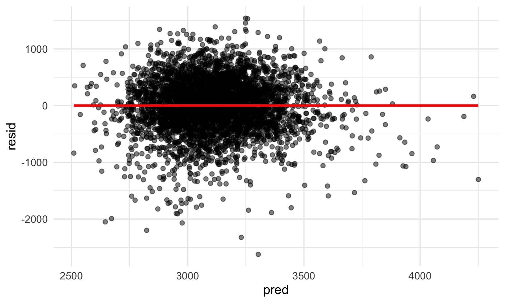
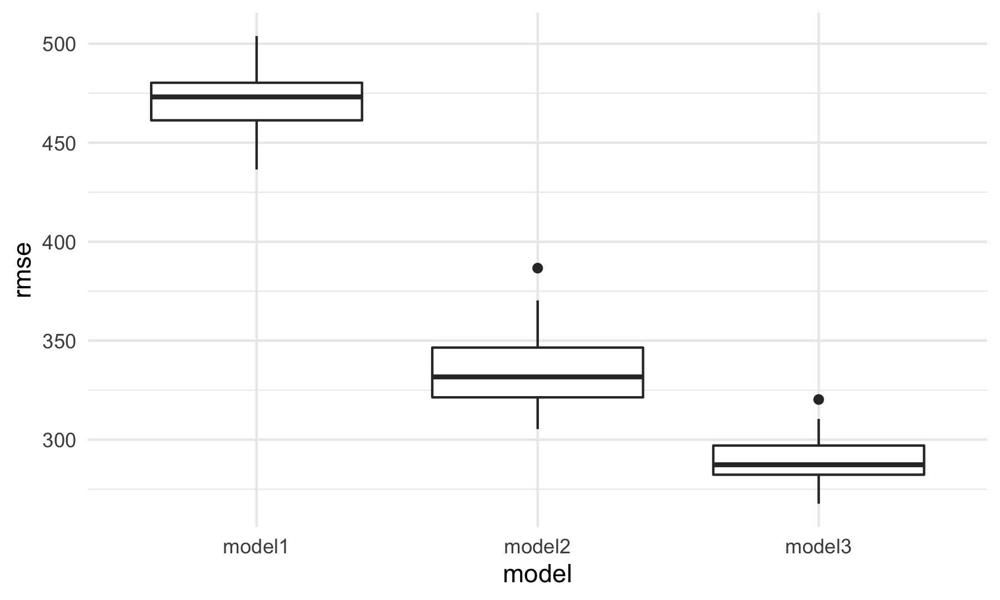

p8105\_hw6\_ly2565
================
Lin Yang
11/29/2021

## Problem 1

Load and clean the dataset.

``` r
birthweight_df = 
  read_csv("data/birthweight.csv") %>% 
  janitor::clean_names() %>% 
  mutate(
    babysex = as.factor(babysex)) %>% 
  drop_na()

birthweight_df
```

    ## # A tibble: 4,342 × 20
    ##    babysex bhead blength   bwt delwt fincome frace gaweeks malform menarche
    ##    <fct>   <dbl>   <dbl> <dbl> <dbl>   <dbl> <dbl>   <dbl>   <dbl>    <dbl>
    ##  1 2          34      51  3629   177      35     1    39.9       0       13
    ##  2 1          34      48  3062   156      65     2    25.9       0       14
    ##  3 2          36      50  3345   148      85     1    39.9       0       12
    ##  4 1          34      52  3062   157      55     1    40         0       14
    ##  5 2          34      52  3374   156       5     1    41.6       0       13
    ##  6 1          33      52  3374   129      55     1    40.7       0       12
    ##  7 2          33      46  2523   126      96     2    40.3       0       14
    ##  8 2          33      49  2778   140       5     1    37.4       0       12
    ##  9 1          36      52  3515   146      85     1    40.3       0       11
    ## 10 1          33      50  3459   169      75     2    40.7       0       12
    ## # … with 4,332 more rows, and 10 more variables: mheight <dbl>, momage <dbl>,
    ## #   mrace <dbl>, parity <dbl>, pnumlbw <dbl>, pnumsga <dbl>, ppbmi <dbl>,
    ## #   ppwt <dbl>, smoken <dbl>, wtgain <dbl>

``` r
model1 = lm(bwt ~fincome + delwt + momage + pnumlbw + smoken + wtgain, data = birthweight_df)

summary(model1)
```

    ## 
    ## Call:
    ## lm(formula = bwt ~ fincome + delwt + momage + pnumlbw + smoken + 
    ##     wtgain, data = birthweight_df)
    ## 
    ## Residuals:
    ##      Min       1Q   Median       3Q      Max 
    ## -2623.50  -272.39    17.37   302.78  1542.27 
    ## 
    ## Coefficients: (1 not defined because of singularities)
    ##              Estimate Std. Error t value Pr(>|t|)    
    ## (Intercept) 1883.5198    58.7694  32.049  < 2e-16 ***
    ## fincome        2.4660     0.2932   8.410  < 2e-16 ***
    ## delwt          4.7862     0.3609  13.263  < 2e-16 ***
    ## momage        13.6647     1.9842   6.887 6.53e-12 ***
    ## pnumlbw            NA         NA      NA       NA    
    ## smoken        -7.4642     0.9768  -7.642 2.62e-14 ***
    ## wtgain         8.1039     0.7329  11.058  < 2e-16 ***
    ## ---
    ## Signif. codes:  0 '***' 0.001 '**' 0.01 '*' 0.05 '.' 0.1 ' ' 1
    ## 
    ## Residual standard error: 474.1 on 4336 degrees of freedom
    ## Multiple R-squared:  0.1441, Adjusted R-squared:  0.1431 
    ## F-statistic:   146 on 5 and 4336 DF,  p-value: < 2.2e-16

``` r
birthweight_df %>% 
  add_predictions(model1) %>% 
  add_residuals(model1) %>% 
  ggplot(aes(x = pred, y = resid)) +
  geom_point(alpha = 0.5) +
  geom_smooth(color = "red", method = "lm", se = FALSE)
```

    ## `geom_smooth()` using formula 'y ~ x'



``` r
model2 = lm(bwt ~blength + gaweeks, data = birthweight_df)
summary(model2)
```

    ## 
    ## Call:
    ## lm(formula = bwt ~ blength + gaweeks, data = birthweight_df)
    ## 
    ## Residuals:
    ##     Min      1Q  Median      3Q     Max 
    ## -1709.6  -215.4   -11.4   208.2  4188.8 
    ## 
    ## Coefficients:
    ##              Estimate Std. Error t value Pr(>|t|)    
    ## (Intercept) -4347.667     97.958  -44.38   <2e-16 ***
    ## blength       128.556      1.990   64.60   <2e-16 ***
    ## gaweeks        27.047      1.718   15.74   <2e-16 ***
    ## ---
    ## Signif. codes:  0 '***' 0.001 '**' 0.01 '*' 0.05 '.' 0.1 ' ' 1
    ## 
    ## Residual standard error: 333.2 on 4339 degrees of freedom
    ## Multiple R-squared:  0.5769, Adjusted R-squared:  0.5767 
    ## F-statistic:  2958 on 2 and 4339 DF,  p-value: < 2.2e-16

``` r
model3 = lm(bwt ~bhead + blength + babysex + 
                 bhead * blength + bhead * babysex + blength * babysex +
                 bhead * blength * babysex, data = birthweight_df)
summary(model3)
```

    ## 
    ## Call:
    ## lm(formula = bwt ~ bhead + blength + babysex + bhead * blength + 
    ##     bhead * babysex + blength * babysex + bhead * blength * babysex, 
    ##     data = birthweight_df)
    ## 
    ## Residuals:
    ##      Min       1Q   Median       3Q      Max 
    ## -1132.99  -190.42   -10.33   178.63  2617.96 
    ## 
    ## Coefficients:
    ##                          Estimate Std. Error t value Pr(>|t|)    
    ## (Intercept)            -7176.8170  1264.8397  -5.674 1.49e-08 ***
    ## bhead                    181.7956    38.0542   4.777 1.84e-06 ***
    ## blength                  102.1269    26.2118   3.896 9.92e-05 ***
    ## babysex2                6374.8684  1677.7669   3.800 0.000147 ***
    ## bhead:blength             -0.5536     0.7802  -0.710 0.478012    
    ## bhead:babysex2          -198.3932    51.0917  -3.883 0.000105 ***
    ## blength:babysex2        -123.7729    35.1185  -3.524 0.000429 ***
    ## bhead:blength:babysex2     3.8781     1.0566   3.670 0.000245 ***
    ## ---
    ## Signif. codes:  0 '***' 0.001 '**' 0.01 '*' 0.05 '.' 0.1 ' ' 1
    ## 
    ## Residual standard error: 287.7 on 4334 degrees of freedom
    ## Multiple R-squared:  0.6849, Adjusted R-squared:  0.6844 
    ## F-statistic:  1346 on 7 and 4334 DF,  p-value: < 2.2e-16

Cross Validation

``` r
cv_df =
  crossv_mc(birthweight_df, 100) %>% 
  mutate(
    train = map(train, as_tibble),
    test = map(test, as_tibble)) %>% 
  mutate(
    model1 = map(train, ~lm(bwt ~ fincome + delwt + momage + pnumlbw + smoken + wtgain, data = .x)),
    model2 = map(train, ~lm(bwt ~blength + gaweeks, data = .x)),
    model3 = map(train, ~lm(bwt ~bhead + blength + babysex + 
                 bhead * blength + bhead * babysex + blength * babysex +
                 bhead * blength * babysex, data = .x))) %>% 
  mutate(
    rmse_model1 = map2_dbl(model1, test, ~rmse(model = .x, data = .y)),
    rmse_model2 = map2_dbl(model2, test, ~rmse(model = .x, data = .y)),
    rmse_model3 = map2_dbl(model3, test, ~rmse(model = .x, data = .y)))
```

``` r
cv_df %>% 
  select(starts_with("rmse")) %>% 
  pivot_longer(
    everything(),
    names_to = "model", 
    values_to = "rmse",
    names_prefix = "rmse_") %>% 
  mutate(model = fct_inorder(model)) %>% 
  ggplot(aes(x = model, y = rmse)) + 
  geom_boxplot()
```


