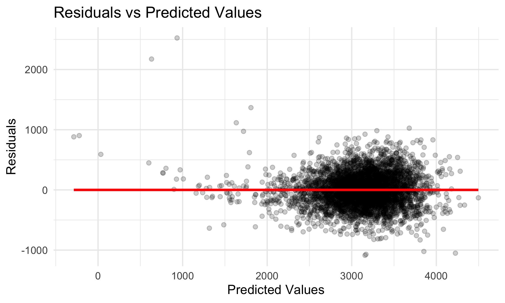
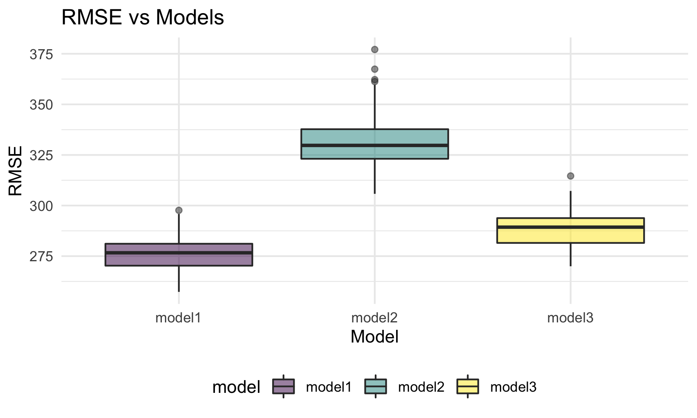
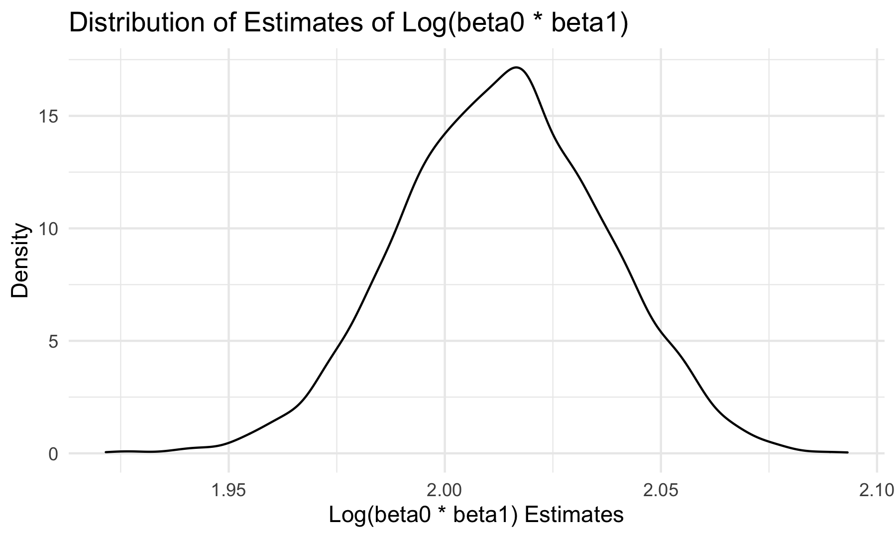

p8105\_hw6\_ly2565
================
Lin Yang
11/29/2021

## Problem 1

### Load and clean the dataset for regression analysis

``` r
birthweight_df = 
  read_csv("data/birthweight.csv") %>% 
  janitor::clean_names()

birthweight_df
```

    ## # A tibble: 4,342 × 20
    ##    babysex bhead blength   bwt delwt fincome frace gaweeks malform menarche
    ##      <dbl> <dbl>   <dbl> <dbl> <dbl>   <dbl> <dbl>   <dbl>   <dbl>    <dbl>
    ##  1       2    34      51  3629   177      35     1    39.9       0       13
    ##  2       1    34      48  3062   156      65     2    25.9       0       14
    ##  3       2    36      50  3345   148      85     1    39.9       0       12
    ##  4       1    34      52  3062   157      55     1    40         0       14
    ##  5       2    34      52  3374   156       5     1    41.6       0       13
    ##  6       1    33      52  3374   129      55     1    40.7       0       12
    ##  7       2    33      46  2523   126      96     2    40.3       0       14
    ##  8       2    33      49  2778   140       5     1    37.4       0       12
    ##  9       1    36      52  3515   146      85     1    40.3       0       11
    ## 10       1    33      50  3459   169      75     2    40.7       0       12
    ## # … with 4,332 more rows, and 10 more variables: mheight <dbl>, momage <dbl>,
    ## #   mrace <dbl>, parity <dbl>, pnumlbw <dbl>, pnumsga <dbl>, ppbmi <dbl>,
    ## #   ppwt <dbl>, smoken <dbl>, wtgain <dbl>

No need to convert numeric to factor for some variables, can fit
regression model based on numeric values.

### Check for missing values

``` r
map(birthweight_df, ~sum(is.na(.)))
```

    ## $babysex
    ## [1] 0
    ## 
    ## $bhead
    ## [1] 0
    ## 
    ## $blength
    ## [1] 0
    ## 
    ## $bwt
    ## [1] 0
    ## 
    ## $delwt
    ## [1] 0
    ## 
    ## $fincome
    ## [1] 0
    ## 
    ## $frace
    ## [1] 0
    ## 
    ## $gaweeks
    ## [1] 0
    ## 
    ## $malform
    ## [1] 0
    ## 
    ## $menarche
    ## [1] 0
    ## 
    ## $mheight
    ## [1] 0
    ## 
    ## $momage
    ## [1] 0
    ## 
    ## $mrace
    ## [1] 0
    ## 
    ## $parity
    ## [1] 0
    ## 
    ## $pnumlbw
    ## [1] 0
    ## 
    ## $pnumsga
    ## [1] 0
    ## 
    ## $ppbmi
    ## [1] 0
    ## 
    ## $ppwt
    ## [1] 0
    ## 
    ## $smoken
    ## [1] 0
    ## 
    ## $wtgain
    ## [1] 0

There are no missing values in the dataset.

### Propose a regression model for birthweight

I built a regression model using a model selection approach called
Backward Elimination which starts with all predictors in the model and
then removes one predictor with the highest p value at a time until all
p values are smaller than 0.01.

``` r
#fit regression model using all predictors
fit_all = lm(bwt ~ ., data = birthweight_df)
summary(fit_all)
```

    ## 
    ## Call:
    ## lm(formula = bwt ~ ., data = birthweight_df)
    ## 
    ## Residuals:
    ##      Min       1Q   Median       3Q      Max 
    ## -1081.29  -184.01    -4.34   174.29  2425.18 
    ## 
    ## Coefficients: (3 not defined because of singularities)
    ##               Estimate Std. Error t value Pr(>|t|)    
    ## (Intercept) -6201.9274   668.2669  -9.281  < 2e-16 ***
    ## babysex        32.3397     8.5490   3.783 0.000157 ***
    ## bhead         134.4216     3.4705  38.733  < 2e-16 ***
    ## blength        76.3778     2.0384  37.469  < 2e-16 ***
    ## delwt           3.9571     0.3989   9.921  < 2e-16 ***
    ## fincome         0.6543     0.1776   3.684 0.000232 ***
    ## frace          -5.8678     8.7969  -0.667 0.504788    
    ## gaweeks        12.0387     1.4809   8.129 5.59e-16 ***
    ## malform        14.2400    71.4190   0.199 0.841969    
    ## menarche       -4.2630     2.9242  -1.458 0.144957    
    ## mheight         4.7511    10.4062   0.457 0.648002    
    ## momage          3.4425     1.1930   2.886 0.003927 ** 
    ## mrace         -48.1943     9.9575  -4.840 1.34e-06 ***
    ## parity         89.8788    40.9290   2.196 0.028147 *  
    ## pnumlbw             NA         NA      NA       NA    
    ## pnumsga             NA         NA      NA       NA    
    ## ppbmi          -0.9683    15.0322  -0.064 0.948642    
    ## ppwt           -2.6603     2.6384  -1.008 0.313354    
    ## smoken         -3.7220     0.5819  -6.396 1.76e-10 ***
    ## wtgain              NA         NA      NA       NA    
    ## ---
    ## Signif. codes:  0 '***' 0.001 '**' 0.01 '*' 0.05 '.' 0.1 ' ' 1
    ## 
    ## Residual standard error: 275.5 on 4325 degrees of freedom
    ## Multiple R-squared:  0.7116, Adjusted R-squared:  0.7105 
    ## F-statistic:   667 on 16 and 4325 DF,  p-value: < 2.2e-16

``` r
#pnumlbw and pnumsga show NA, check the number of unique values in the two columns
unique(pull(birthweight_df, pnumlbw))
```

    ## [1] 0

``` r
unique(pull(birthweight_df, pnumsga))
```

    ## [1] 0

``` r
#no pnumlbw
step1 = update(fit_all, . ~ . -pnumlbw)
summary(step1)
```

    ## 
    ## Call:
    ## lm(formula = bwt ~ babysex + bhead + blength + delwt + fincome + 
    ##     frace + gaweeks + malform + menarche + mheight + momage + 
    ##     mrace + parity + pnumsga + ppbmi + ppwt + smoken + wtgain, 
    ##     data = birthweight_df)
    ## 
    ## Residuals:
    ##      Min       1Q   Median       3Q      Max 
    ## -1081.29  -184.01    -4.34   174.29  2425.18 
    ## 
    ## Coefficients: (2 not defined because of singularities)
    ##               Estimate Std. Error t value Pr(>|t|)    
    ## (Intercept) -6201.9274   668.2669  -9.281  < 2e-16 ***
    ## babysex        32.3397     8.5490   3.783 0.000157 ***
    ## bhead         134.4216     3.4705  38.733  < 2e-16 ***
    ## blength        76.3778     2.0384  37.469  < 2e-16 ***
    ## delwt           3.9571     0.3989   9.921  < 2e-16 ***
    ## fincome         0.6543     0.1776   3.684 0.000232 ***
    ## frace          -5.8678     8.7969  -0.667 0.504788    
    ## gaweeks        12.0387     1.4809   8.129 5.59e-16 ***
    ## malform        14.2400    71.4190   0.199 0.841969    
    ## menarche       -4.2630     2.9242  -1.458 0.144957    
    ## mheight         4.7511    10.4062   0.457 0.648002    
    ## momage          3.4425     1.1930   2.886 0.003927 ** 
    ## mrace         -48.1943     9.9575  -4.840 1.34e-06 ***
    ## parity         89.8788    40.9290   2.196 0.028147 *  
    ## pnumsga             NA         NA      NA       NA    
    ## ppbmi          -0.9683    15.0322  -0.064 0.948642    
    ## ppwt           -2.6603     2.6384  -1.008 0.313354    
    ## smoken         -3.7220     0.5819  -6.396 1.76e-10 ***
    ## wtgain              NA         NA      NA       NA    
    ## ---
    ## Signif. codes:  0 '***' 0.001 '**' 0.01 '*' 0.05 '.' 0.1 ' ' 1
    ## 
    ## Residual standard error: 275.5 on 4325 degrees of freedom
    ## Multiple R-squared:  0.7116, Adjusted R-squared:  0.7105 
    ## F-statistic:   667 on 16 and 4325 DF,  p-value: < 2.2e-16

``` r
#no pnumsga
step2 = update(step1, . ~ . -pnumsga)
summary(step2)
```

    ## 
    ## Call:
    ## lm(formula = bwt ~ babysex + bhead + blength + delwt + fincome + 
    ##     frace + gaweeks + malform + menarche + mheight + momage + 
    ##     mrace + parity + ppbmi + ppwt + smoken + wtgain, data = birthweight_df)
    ## 
    ## Residuals:
    ##      Min       1Q   Median       3Q      Max 
    ## -1081.29  -184.01    -4.34   174.29  2425.18 
    ## 
    ## Coefficients: (1 not defined because of singularities)
    ##               Estimate Std. Error t value Pr(>|t|)    
    ## (Intercept) -6201.9274   668.2669  -9.281  < 2e-16 ***
    ## babysex        32.3397     8.5490   3.783 0.000157 ***
    ## bhead         134.4216     3.4705  38.733  < 2e-16 ***
    ## blength        76.3778     2.0384  37.469  < 2e-16 ***
    ## delwt           3.9571     0.3989   9.921  < 2e-16 ***
    ## fincome         0.6543     0.1776   3.684 0.000232 ***
    ## frace          -5.8678     8.7969  -0.667 0.504788    
    ## gaweeks        12.0387     1.4809   8.129 5.59e-16 ***
    ## malform        14.2400    71.4190   0.199 0.841969    
    ## menarche       -4.2630     2.9242  -1.458 0.144957    
    ## mheight         4.7511    10.4062   0.457 0.648002    
    ## momage          3.4425     1.1930   2.886 0.003927 ** 
    ## mrace         -48.1943     9.9575  -4.840 1.34e-06 ***
    ## parity         89.8788    40.9290   2.196 0.028147 *  
    ## ppbmi          -0.9683    15.0322  -0.064 0.948642    
    ## ppwt           -2.6603     2.6384  -1.008 0.313354    
    ## smoken         -3.7220     0.5819  -6.396 1.76e-10 ***
    ## wtgain              NA         NA      NA       NA    
    ## ---
    ## Signif. codes:  0 '***' 0.001 '**' 0.01 '*' 0.05 '.' 0.1 ' ' 1
    ## 
    ## Residual standard error: 275.5 on 4325 degrees of freedom
    ## Multiple R-squared:  0.7116, Adjusted R-squared:  0.7105 
    ## F-statistic:   667 on 16 and 4325 DF,  p-value: < 2.2e-16

``` r
#no wtgain
step3 = update(step2, . ~ . -wtgain)
summary(step3)
```

    ## 
    ## Call:
    ## lm(formula = bwt ~ babysex + bhead + blength + delwt + fincome + 
    ##     frace + gaweeks + malform + menarche + mheight + momage + 
    ##     mrace + parity + ppbmi + ppwt + smoken, data = birthweight_df)
    ## 
    ## Residuals:
    ##      Min       1Q   Median       3Q      Max 
    ## -1081.29  -184.01    -4.34   174.29  2425.18 
    ## 
    ## Coefficients:
    ##               Estimate Std. Error t value Pr(>|t|)    
    ## (Intercept) -6201.9274   668.2669  -9.281  < 2e-16 ***
    ## babysex        32.3397     8.5490   3.783 0.000157 ***
    ## bhead         134.4216     3.4705  38.733  < 2e-16 ***
    ## blength        76.3778     2.0384  37.469  < 2e-16 ***
    ## delwt           3.9571     0.3989   9.921  < 2e-16 ***
    ## fincome         0.6543     0.1776   3.684 0.000232 ***
    ## frace          -5.8678     8.7969  -0.667 0.504788    
    ## gaweeks        12.0387     1.4809   8.129 5.59e-16 ***
    ## malform        14.2400    71.4190   0.199 0.841969    
    ## menarche       -4.2630     2.9242  -1.458 0.144957    
    ## mheight         4.7511    10.4062   0.457 0.648002    
    ## momage          3.4425     1.1930   2.886 0.003927 ** 
    ## mrace         -48.1943     9.9575  -4.840 1.34e-06 ***
    ## parity         89.8788    40.9290   2.196 0.028147 *  
    ## ppbmi          -0.9683    15.0322  -0.064 0.948642    
    ## ppwt           -2.6603     2.6384  -1.008 0.313354    
    ## smoken         -3.7220     0.5819  -6.396 1.76e-10 ***
    ## ---
    ## Signif. codes:  0 '***' 0.001 '**' 0.01 '*' 0.05 '.' 0.1 ' ' 1
    ## 
    ## Residual standard error: 275.5 on 4325 degrees of freedom
    ## Multiple R-squared:  0.7116, Adjusted R-squared:  0.7105 
    ## F-statistic:   667 on 16 and 4325 DF,  p-value: < 2.2e-16

``` r
#no ppbmi
step4 = update(step3, . ~ . -ppbmi)
summary(step4)
```

    ## 
    ## Call:
    ## lm(formula = bwt ~ babysex + bhead + blength + delwt + fincome + 
    ##     frace + gaweeks + malform + menarche + mheight + momage + 
    ##     mrace + parity + ppwt + smoken, data = birthweight_df)
    ## 
    ## Residuals:
    ##      Min       1Q   Median       3Q      Max 
    ## -1081.31  -184.16    -4.25   174.24  2425.21 
    ## 
    ## Coefficients:
    ##               Estimate Std. Error t value Pr(>|t|)    
    ## (Intercept) -6243.9731   143.2612 -43.585  < 2e-16 ***
    ## babysex        32.3448     8.5477   3.784 0.000156 ***
    ## bhead         134.4157     3.4689  38.749  < 2e-16 ***
    ## blength        76.3777     2.0382  37.473  < 2e-16 ***
    ## delwt           3.9574     0.3988   9.924  < 2e-16 ***
    ## fincome         0.6542     0.1776   3.684 0.000232 ***
    ## frace          -5.8716     8.7957  -0.668 0.504459    
    ## gaweeks        12.0396     1.4807   8.131 5.50e-16 ***
    ## malform        14.2747    71.4088   0.200 0.841567    
    ## menarche       -4.2578     2.9227  -1.457 0.145248    
    ## mheight         5.4112     1.8137   2.984 0.002865 ** 
    ## momage          3.4420     1.1929   2.886 0.003927 ** 
    ## mrace         -48.1766     9.9526  -4.841 1.34e-06 ***
    ## parity         89.9155    40.9203   2.197 0.028049 *  
    ## ppwt           -2.8279     0.4369  -6.472 1.07e-10 ***
    ## smoken         -3.7214     0.5818  -6.397 1.76e-10 ***
    ## ---
    ## Signif. codes:  0 '***' 0.001 '**' 0.01 '*' 0.05 '.' 0.1 ' ' 1
    ## 
    ## Residual standard error: 275.5 on 4326 degrees of freedom
    ## Multiple R-squared:  0.7116, Adjusted R-squared:  0.7106 
    ## F-statistic: 711.6 on 15 and 4326 DF,  p-value: < 2.2e-16

``` r
#no malform
step5 = update(step4, . ~ . -malform)
summary(step5)
```

    ## 
    ## Call:
    ## lm(formula = bwt ~ babysex + bhead + blength + delwt + fincome + 
    ##     frace + gaweeks + menarche + mheight + momage + mrace + parity + 
    ##     ppwt + smoken, data = birthweight_df)
    ## 
    ## Residuals:
    ##      Min       1Q   Median       3Q      Max 
    ## -1081.39  -184.01    -4.03   174.21  2424.93 
    ## 
    ## Coefficients:
    ##               Estimate Std. Error t value Pr(>|t|)    
    ## (Intercept) -6243.3692   143.2134 -43.595  < 2e-16 ***
    ## babysex        32.3202     8.5458   3.782 0.000158 ***
    ## bhead         134.4214     3.4684  38.756  < 2e-16 ***
    ## blength        76.3714     2.0377  37.479  < 2e-16 ***
    ## delwt           3.9600     0.3985   9.937  < 2e-16 ***
    ## fincome         0.6535     0.1775   3.681 0.000235 ***
    ## frace          -5.8853     8.7945  -0.669 0.503397    
    ## gaweeks        12.0366     1.4804   8.130 5.53e-16 ***
    ## menarche       -4.2645     2.9222  -1.459 0.144538    
    ## mheight         5.4066     1.8133   2.982 0.002884 ** 
    ## momage          3.4474     1.1924   2.891 0.003858 ** 
    ## mrace         -48.1950     9.9510  -4.843 1.32e-06 ***
    ## parity         89.8801    40.9154   2.197 0.028092 *  
    ## ppwt           -2.8305     0.4367  -6.482 1.01e-10 ***
    ## smoken         -3.7184     0.5815  -6.394 1.78e-10 ***
    ## ---
    ## Signif. codes:  0 '***' 0.001 '**' 0.01 '*' 0.05 '.' 0.1 ' ' 1
    ## 
    ## Residual standard error: 275.5 on 4327 degrees of freedom
    ## Multiple R-squared:  0.7116, Adjusted R-squared:  0.7107 
    ## F-statistic: 762.6 on 14 and 4327 DF,  p-value: < 2.2e-16

``` r
#no frace
step6 = update(step5, . ~ . -frace)
summary(step6)
```

    ## 
    ## Call:
    ## lm(formula = bwt ~ babysex + bhead + blength + delwt + fincome + 
    ##     gaweeks + menarche + mheight + momage + mrace + parity + 
    ##     ppwt + smoken, data = birthweight_df)
    ## 
    ## Residuals:
    ##      Min       1Q   Median       3Q      Max 
    ## -1081.54  -184.11    -3.95   174.35  2425.63 
    ## 
    ## Coefficients:
    ##               Estimate Std. Error t value Pr(>|t|)    
    ## (Intercept) -6246.3672   143.1342 -43.640  < 2e-16 ***
    ## babysex        32.3171     8.5453   3.782 0.000158 ***
    ## bhead         134.4298     3.4681  38.761  < 2e-16 ***
    ## blength        76.3760     2.0376  37.484  < 2e-16 ***
    ## delwt           3.9564     0.3985   9.929  < 2e-16 ***
    ## fincome         0.6597     0.1773   3.721 0.000201 ***
    ## gaweeks        12.0396     1.4803   8.133 5.42e-16 ***
    ## menarche       -4.3140     2.9211  -1.477 0.139792    
    ## mheight         5.4408     1.8125   3.002 0.002699 ** 
    ## momage          3.4549     1.1923   2.898 0.003778 ** 
    ## mrace         -53.4990     6.0167  -8.892  < 2e-16 ***
    ## parity         89.9677    40.9125   2.199 0.027929 *  
    ## ppwt           -2.8323     0.4367  -6.486 9.79e-11 ***
    ## smoken         -3.7116     0.5814  -6.384 1.90e-10 ***
    ## ---
    ## Signif. codes:  0 '***' 0.001 '**' 0.01 '*' 0.05 '.' 0.1 ' ' 1
    ## 
    ## Residual standard error: 275.5 on 4328 degrees of freedom
    ## Multiple R-squared:  0.7116, Adjusted R-squared:  0.7107 
    ## F-statistic: 821.4 on 13 and 4328 DF,  p-value: < 2.2e-16

``` r
#no menarche
step7 = update(step6, . ~ . -menarche)
summary(step7)
```

    ## 
    ## Call:
    ## lm(formula = bwt ~ babysex + bhead + blength + delwt + fincome + 
    ##     gaweeks + mheight + momage + mrace + parity + ppwt + smoken, 
    ##     data = birthweight_df)
    ## 
    ## Residuals:
    ##     Min      1Q  Median      3Q     Max 
    ## -1070.0  -184.4    -3.9   173.9  2438.7 
    ## 
    ## Coefficients:
    ##               Estimate Std. Error t value Pr(>|t|)    
    ## (Intercept) -6279.0969   141.4274 -44.398  < 2e-16 ***
    ## babysex        32.3715     8.5464   3.788 0.000154 ***
    ## bhead         134.3587     3.4683  38.739  < 2e-16 ***
    ## blength        76.4406     2.0374  37.519  < 2e-16 ***
    ## delwt           3.9809     0.3982   9.998  < 2e-16 ***
    ## fincome         0.6760     0.1769   3.821 0.000135 ***
    ## gaweeks        12.0404     1.4805   8.132 5.44e-16 ***
    ## mheight         5.1007     1.7981   2.837 0.004579 ** 
    ## momage          3.1116     1.1696   2.660 0.007833 ** 
    ## mrace         -53.9732     6.0089  -8.982  < 2e-16 ***
    ## parity         89.5306    40.9170   2.188 0.028716 *  
    ## ppwt           -2.8087     0.4364  -6.436 1.36e-10 ***
    ## smoken         -3.7242     0.5814  -6.406 1.66e-10 ***
    ## ---
    ## Signif. codes:  0 '***' 0.001 '**' 0.01 '*' 0.05 '.' 0.1 ' ' 1
    ## 
    ## Residual standard error: 275.5 on 4329 degrees of freedom
    ## Multiple R-squared:  0.7114, Adjusted R-squared:  0.7106 
    ## F-statistic: 889.4 on 12 and 4329 DF,  p-value: < 2.2e-16

``` r
#no parity
step8 = update(step7, . ~ . -parity)
summary(step8)
```

    ## 
    ## Call:
    ## lm(formula = bwt ~ babysex + bhead + blength + delwt + fincome + 
    ##     gaweeks + mheight + momage + mrace + ppwt + smoken, data = birthweight_df)
    ## 
    ## Residuals:
    ##      Min       1Q   Median       3Q      Max 
    ## -1069.88  -185.48    -3.94   174.74  2436.12 
    ## 
    ## Coefficients:
    ##               Estimate Std. Error t value Pr(>|t|)    
    ## (Intercept) -6271.1159   141.4421 -44.337  < 2e-16 ***
    ## babysex        32.9246     8.5464   3.852 0.000119 ***
    ## bhead         134.4895     3.4693  38.766  < 2e-16 ***
    ## blength        76.3771     2.0381  37.475  < 2e-16 ***
    ## delwt           4.0070     0.3982  10.064  < 2e-16 ***
    ## fincome         0.6608     0.1769   3.736 0.000189 ***
    ## gaweeks        11.7736     1.4761   7.976 1.92e-15 ***
    ## mheight         5.0636     1.7988   2.815 0.004899 ** 
    ## momage          3.3006     1.1669   2.829 0.004697 ** 
    ## mrace         -54.0996     6.0113  -9.000  < 2e-16 ***
    ## ppwt           -2.8387     0.4364  -6.505 8.67e-11 ***
    ## smoken         -3.7317     0.5816  -6.416 1.55e-10 ***
    ## ---
    ## Signif. codes:  0 '***' 0.001 '**' 0.01 '*' 0.05 '.' 0.1 ' ' 1
    ## 
    ## Residual standard error: 275.6 on 4330 degrees of freedom
    ## Multiple R-squared:  0.7111, Adjusted R-squared:  0.7104 
    ## F-statistic:   969 on 11 and 4330 DF,  p-value: < 2.2e-16

Using the Backward Elimination approach, I first removed variables,
`pnumlbw`, `pnumsga`, `wtgain` which returned NA for all estimates. The
reason why `wtgain` showed NA might be that it highly correlated with
other variables, like `delwt`: mother’s weight at delivery and `ppwt`:
mother’s pre-pregnancy weight. In terms of `pnumlbw` and `pnumsga`, they
returned NA because there were only values of 0 in the two columns.

After removing all non-significant predictors, I fitted a regression
model for baby birthweight based on predictors: `babysex`, `bhead`,
`blength`, `delwt`, `fincome`, `gaweeks`, `mheight`, `momage`, `mrace`,
`ppwt`, and `smoken`.

``` r
model1 = lm(bwt ~babysex + bhead + blength + delwt + fincome + gaweeks + mheight + momage + mrace + ppwt + smoken, data = birthweight_df)

summary(model1)
```

    ## 
    ## Call:
    ## lm(formula = bwt ~ babysex + bhead + blength + delwt + fincome + 
    ##     gaweeks + mheight + momage + mrace + ppwt + smoken, data = birthweight_df)
    ## 
    ## Residuals:
    ##      Min       1Q   Median       3Q      Max 
    ## -1069.88  -185.48    -3.94   174.74  2436.12 
    ## 
    ## Coefficients:
    ##               Estimate Std. Error t value Pr(>|t|)    
    ## (Intercept) -6271.1159   141.4421 -44.337  < 2e-16 ***
    ## babysex        32.9246     8.5464   3.852 0.000119 ***
    ## bhead         134.4895     3.4693  38.766  < 2e-16 ***
    ## blength        76.3771     2.0381  37.475  < 2e-16 ***
    ## delwt           4.0070     0.3982  10.064  < 2e-16 ***
    ## fincome         0.6608     0.1769   3.736 0.000189 ***
    ## gaweeks        11.7736     1.4761   7.976 1.92e-15 ***
    ## mheight         5.0636     1.7988   2.815 0.004899 ** 
    ## momage          3.3006     1.1669   2.829 0.004697 ** 
    ## mrace         -54.0996     6.0113  -9.000  < 2e-16 ***
    ## ppwt           -2.8387     0.4364  -6.505 8.67e-11 ***
    ## smoken         -3.7317     0.5816  -6.416 1.55e-10 ***
    ## ---
    ## Signif. codes:  0 '***' 0.001 '**' 0.01 '*' 0.05 '.' 0.1 ' ' 1
    ## 
    ## Residual standard error: 275.6 on 4330 degrees of freedom
    ## Multiple R-squared:  0.7111, Adjusted R-squared:  0.7104 
    ## F-statistic:   969 on 11 and 4330 DF,  p-value: < 2.2e-16

``` r
broom::tidy(model1)
```

    ## # A tibble: 12 × 5
    ##    term         estimate std.error statistic   p.value
    ##    <chr>           <dbl>     <dbl>     <dbl>     <dbl>
    ##  1 (Intercept) -6271.      141.       -44.3  0        
    ##  2 babysex        32.9       8.55       3.85 1.19e-  4
    ##  3 bhead         134.        3.47      38.8  1.79e-282
    ##  4 blength        76.4       2.04      37.5  1.83e-266
    ##  5 delwt           4.01      0.398     10.1  1.45e- 23
    ##  6 fincome         0.661     0.177      3.74 1.89e-  4
    ##  7 gaweeks        11.8       1.48       7.98 1.92e- 15
    ##  8 mheight         5.06      1.80       2.82 4.90e-  3
    ##  9 momage          3.30      1.17       2.83 4.70e-  3
    ## 10 mrace         -54.1       6.01      -9.00 3.32e- 19
    ## 11 ppwt           -2.84      0.436     -6.50 8.67e- 11
    ## 12 smoken         -3.73      0.582     -6.42 1.55e- 10

Make a plot of model residuals against fitted values.

``` r
birthweight_df %>% 
  add_predictions(model1) %>% 
  add_residuals(model1) %>% 
  ggplot(aes(x = pred, y = resid)) +
  geom_point(alpha = 0.2) +
  geom_smooth(color = "red", method = "lm", se = FALSE) +
  labs(
    x = "Predicted Values",
    y = "Residuals",
    title = "Residuals vs Predicted Values"
  )
```



Based on this plot, residual values appear to be evenly distributed
around 0, indicating constant variance of residuals. However, there are
three predicted values less than 0, which may be outliers, and there are
two obvious outliers with residuals over 2000.

### Fit the other two models

-   One using length at birth and gestational age as predictors (main
    effects only)
-   One using head circumference, length, sex, and all interactions
    (including the three-way interaction) between these

``` r
model2 = lm(bwt ~blength + gaweeks, data = birthweight_df)
summary(model2)
```

    ## 
    ## Call:
    ## lm(formula = bwt ~ blength + gaweeks, data = birthweight_df)
    ## 
    ## Residuals:
    ##     Min      1Q  Median      3Q     Max 
    ## -1709.6  -215.4   -11.4   208.2  4188.8 
    ## 
    ## Coefficients:
    ##              Estimate Std. Error t value Pr(>|t|)    
    ## (Intercept) -4347.667     97.958  -44.38   <2e-16 ***
    ## blength       128.556      1.990   64.60   <2e-16 ***
    ## gaweeks        27.047      1.718   15.74   <2e-16 ***
    ## ---
    ## Signif. codes:  0 '***' 0.001 '**' 0.01 '*' 0.05 '.' 0.1 ' ' 1
    ## 
    ## Residual standard error: 333.2 on 4339 degrees of freedom
    ## Multiple R-squared:  0.5769, Adjusted R-squared:  0.5767 
    ## F-statistic:  2958 on 2 and 4339 DF,  p-value: < 2.2e-16

``` r
broom::tidy(model2)
```

    ## # A tibble: 3 × 5
    ##   term        estimate std.error statistic  p.value
    ##   <chr>          <dbl>     <dbl>     <dbl>    <dbl>
    ## 1 (Intercept)  -4348.      98.0      -44.4 0       
    ## 2 blength        129.       1.99      64.6 0       
    ## 3 gaweeks         27.0      1.72      15.7 2.36e-54

``` r
model3 = lm(bwt ~bhead + blength + babysex + 
                 bhead * blength + bhead * babysex + blength * babysex +
                 bhead * blength * babysex, data = birthweight_df)
summary(model3)
```

    ## 
    ## Call:
    ## lm(formula = bwt ~ bhead + blength + babysex + bhead * blength + 
    ##     bhead * babysex + blength * babysex + bhead * blength * babysex, 
    ##     data = birthweight_df)
    ## 
    ## Residuals:
    ##      Min       1Q   Median       3Q      Max 
    ## -1132.99  -190.42   -10.33   178.63  2617.96 
    ## 
    ## Coefficients:
    ##                         Estimate Std. Error t value Pr(>|t|)    
    ## (Intercept)           -13551.685   2759.413  -4.911 9.39e-07 ***
    ## bhead                    380.189     83.395   4.559 5.28e-06 ***
    ## blength                  225.900     57.398   3.936 8.43e-05 ***
    ## babysex                 6374.868   1677.767   3.800 0.000147 ***
    ## bhead:blength             -4.432      1.715  -2.583 0.009815 ** 
    ## bhead:babysex           -198.393     51.092  -3.883 0.000105 ***
    ## blength:babysex         -123.773     35.119  -3.524 0.000429 ***
    ## bhead:blength:babysex      3.878      1.057   3.670 0.000245 ***
    ## ---
    ## Signif. codes:  0 '***' 0.001 '**' 0.01 '*' 0.05 '.' 0.1 ' ' 1
    ## 
    ## Residual standard error: 287.7 on 4334 degrees of freedom
    ## Multiple R-squared:  0.6849, Adjusted R-squared:  0.6844 
    ## F-statistic:  1346 on 7 and 4334 DF,  p-value: < 2.2e-16

``` r
broom::tidy(model3)
```

    ## # A tibble: 8 × 5
    ##   term                   estimate std.error statistic     p.value
    ##   <chr>                     <dbl>     <dbl>     <dbl>       <dbl>
    ## 1 (Intercept)           -13552.     2759.       -4.91 0.000000939
    ## 2 bhead                    380.       83.4       4.56 0.00000528 
    ## 3 blength                  226.       57.4       3.94 0.0000843  
    ## 4 babysex                 6375.     1678.        3.80 0.000147   
    ## 5 bhead:blength             -4.43      1.72     -2.58 0.00981    
    ## 6 bhead:babysex           -198.       51.1      -3.88 0.000105   
    ## 7 blength:babysex         -124.       35.1      -3.52 0.000429   
    ## 8 bhead:blength:babysex      3.88      1.06      3.67 0.000245

### Compare the three models in terms of cross validation

``` r
cv_df =
  crossv_mc(birthweight_df, 100) %>% 
  mutate(
    train = map(train, as_tibble),
    test = map(test, as_tibble)) %>% 
  mutate(
    model1 = map(train, ~lm(bwt ~ babysex + bhead + blength + delwt + fincome + gaweeks + mheight + momage + mrace + ppwt + smoken, data = .x)),
    model2 = map(train, ~lm(bwt ~blength + gaweeks, data = .x)),
    model3 = map(train, ~lm(bwt ~bhead + blength + babysex + 
                 bhead * blength + bhead * babysex + blength * babysex +
                 bhead * blength * babysex, data = .x))) %>% 
  mutate(
    rmse_model1 = map2_dbl(model1, test, ~rmse(model = .x, data = .y)),
    rmse_model2 = map2_dbl(model2, test, ~rmse(model = .x, data = .y)),
    rmse_model3 = map2_dbl(model3, test, ~rmse(model = .x, data = .y))) %>% 
  select(-train, -test, -c(model1:model3))

cv_df 
```

    ## # A tibble: 100 × 4
    ##    .id   rmse_model1 rmse_model2 rmse_model3
    ##    <chr>       <dbl>       <dbl>       <dbl>
    ##  1 001          284.        360.        302.
    ##  2 002          270.        322.        280.
    ##  3 003          264.        307.        279.
    ##  4 004          287.        337.        298.
    ##  5 005          289.        367.        303.
    ##  6 006          271.        314.        282.
    ##  7 007          278.        357.        290.
    ##  8 008          288.        346.        301.
    ##  9 009          272.        327.        287.
    ## 10 010          275.        338.        292.
    ## # … with 90 more rows

Make a boxplot showing rmse distribution across 3 models.

``` r
cv_df %>% 
  select(starts_with("rmse")) %>% 
  pivot_longer(
    everything(),
    names_to = "model", 
    values_to = "rmse",
    names_prefix = "rmse_") %>% 
  mutate(model = fct_inorder(model)) %>% 
  ggplot(aes(x = model, y = rmse)) + 
  geom_boxplot(aes(fill = model), alpha = 0.5) +
  labs(
    x = "Model",
    y = "RMSE",
    title = "RMSE vs Models"
  )
```



The boxplot indicates that model1 has the lowest prediction error
distribution, and model2 has the highest one. This suggests that model1
is the best fit for birthweight among the three models.

## Problem 2

### Load the 2017 Central Park weather data

``` r
weather_df = 
  rnoaa::meteo_pull_monitors(
    c("USW00094728"),
    var = c("PRCP", "TMIN", "TMAX"), 
    date_min = "2017-01-01",
    date_max = "2017-12-31") %>%
  mutate(
    name = recode(id, USW00094728 = "CentralPark_NY"),
    tmin = tmin / 10,
    tmax = tmax / 10) %>%
  select(name, id, everything())

weather_df
```

    ## # A tibble: 365 × 6
    ##    name           id          date        prcp  tmax  tmin
    ##    <chr>          <chr>       <date>     <dbl> <dbl> <dbl>
    ##  1 CentralPark_NY USW00094728 2017-01-01     0   8.9   4.4
    ##  2 CentralPark_NY USW00094728 2017-01-02    53   5     2.8
    ##  3 CentralPark_NY USW00094728 2017-01-03   147   6.1   3.9
    ##  4 CentralPark_NY USW00094728 2017-01-04     0  11.1   1.1
    ##  5 CentralPark_NY USW00094728 2017-01-05     0   1.1  -2.7
    ##  6 CentralPark_NY USW00094728 2017-01-06    13   0.6  -3.8
    ##  7 CentralPark_NY USW00094728 2017-01-07    81  -3.2  -6.6
    ##  8 CentralPark_NY USW00094728 2017-01-08     0  -3.8  -8.8
    ##  9 CentralPark_NY USW00094728 2017-01-09     0  -4.9  -9.9
    ## 10 CentralPark_NY USW00094728 2017-01-10     0   7.8  -6  
    ## # … with 355 more rows

### Bootstrapping

Draw 5000 bootstrap samples.

``` r
boot_strap_df = 
  weather_df %>% 
  bootstrap(n = 5000)

boot_strap_df
```

    ## # A tibble: 5,000 × 2
    ##    strap                .id  
    ##    <list>               <chr>
    ##  1 <resample [365 x 6]> 0001 
    ##  2 <resample [365 x 6]> 0002 
    ##  3 <resample [365 x 6]> 0003 
    ##  4 <resample [365 x 6]> 0004 
    ##  5 <resample [365 x 6]> 0005 
    ##  6 <resample [365 x 6]> 0006 
    ##  7 <resample [365 x 6]> 0007 
    ##  8 <resample [365 x 6]> 0008 
    ##  9 <resample [365 x 6]> 0009 
    ## 10 <resample [365 x 6]> 0010 
    ## # … with 4,990 more rows

Produce an estimate of r squared for each bootstrap sample and plot the
distribution of estimates.

``` r
r_squared_results = 
  boot_strap_df %>% 
  mutate(
    models = map(strap, ~lm(tmax ~ tmin, data = .x)),
    results = map(models, broom::glance)) %>%
  select(-strap, -models) %>% 
  unnest(results) %>% 
  select(.id, r.squared)

r_squared_results
```

    ## # A tibble: 5,000 × 2
    ##    .id   r.squared
    ##    <chr>     <dbl>
    ##  1 0001      0.898
    ##  2 0002      0.913
    ##  3 0003      0.902
    ##  4 0004      0.904
    ##  5 0005      0.920
    ##  6 0006      0.904
    ##  7 0007      0.917
    ##  8 0008      0.919
    ##  9 0009      0.915
    ## 10 0010      0.906
    ## # … with 4,990 more rows

``` r
r_squared_results %>% 
  ggplot(aes(x = r.squared)) +
  geom_density() +
  labs(
    x = "R Squared Estimates", 
    y = "Density",
    title = "Distribution of R Squared Estimates")
```


Calculate 95% confidence interval for r squared.

``` r
r_squared_results %>% 
  summarize(
    ci_lower = quantile(r.squared, 0.025),
    ci_upper = quantile(r.squared, 0.975)) %>% 
  knitr::kable()
```

| ci\_lower | ci\_upper |
|----------:|----------:|
| 0.8936977 | 0.9274807 |

R squared estimates appear to be normally distributed with a mean of
0.911 and sd of 0.009. There are no obvious outliers. The 95% confidence
interval for r squared is (0.894, 0.927).

Produce an estimate of log(beta0 \* beta1) for each bootstrap group and
plot the distribution of estimates.

``` r
log_results = 
  boot_strap_df %>% 
  mutate(
    models = map(strap, ~lm(tmax ~ tmin, data = .x)),
    results = map(models, broom::tidy)) %>%
  select(-strap, -models) %>% 
  unnest(results) %>% 
  select(.id, term, estimate) %>% 
  pivot_wider(
    names_from = "term",
    values_from = "estimate") %>% 
  rename(
    beta0 = `(Intercept)`, 
    beta1 = tmin) %>% 
  mutate(log = log(beta0 * beta1)) 
 
log_results
```

    ## # A tibble: 5,000 × 4
    ##    .id   beta0 beta1   log
    ##    <chr> <dbl> <dbl> <dbl>
    ##  1 0001   7.54  1.02  2.04
    ##  2 0002   6.86  1.06  1.99
    ##  3 0003   7.55  1.02  2.04
    ##  4 0004   7.24  1.03  2.01
    ##  5 0005   6.89  1.06  1.99
    ##  6 0006   7.15  1.06  2.02
    ##  7 0007   7.20  1.04  2.02
    ##  8 0008   7.26  1.04  2.02
    ##  9 0009   7.19  1.05  2.03
    ## 10 0010   7.34  1.04  2.03
    ## # … with 4,990 more rows

``` r
log_results %>% 
  ggplot(aes(x = log)) +
  geom_density() +
  labs(
    x = "Log(beta0 * beta1) Estimates",
    y = "Density",
    title = "Distribution of Estimates of Log(beta0 * beta1)")
```



Calculate 95% confidence interval for log(beta0 \* beta1).

``` r
log_results %>% 
  summarize(
    ci_lower = quantile(log, 0.025),
    ci_upper = quantile(log, 0.975)) %>% 
  knitr::kable()
```

| ci\_lower | ci\_upper |
|----------:|----------:|
|  1.966942 |  2.058528 |

Log(beta0 \* beta1) estimates appear to be normally distributed with a
mean of 2.013 and sd of 0.024. There are no obvious outliers. The 95%
confidence interval for log(beta0 \* beta1) is (1.967, 2.059).
