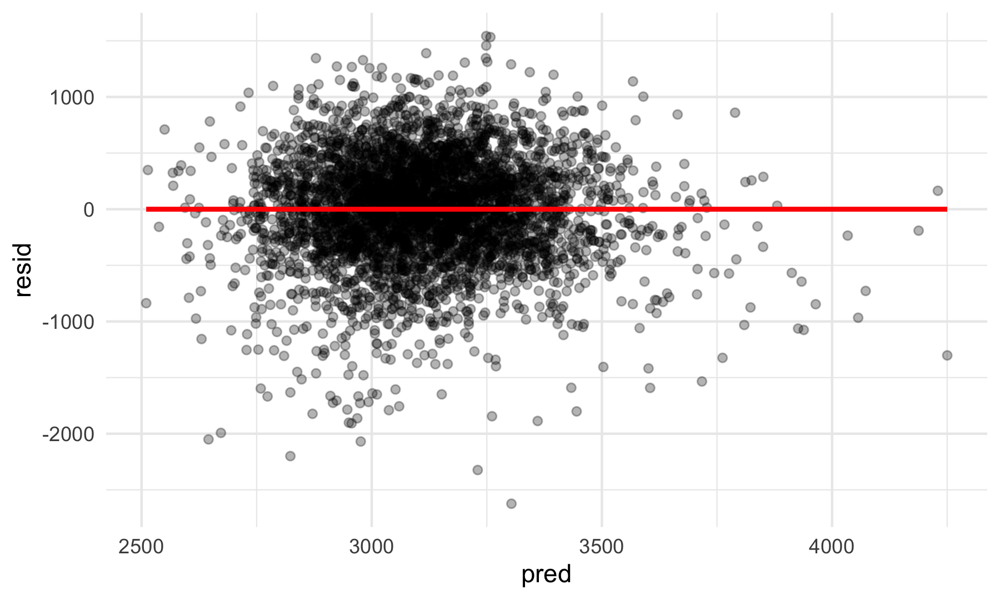
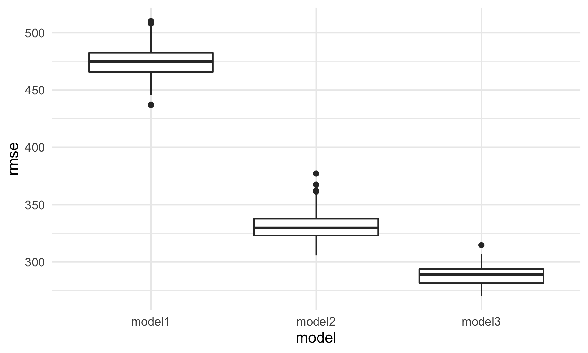
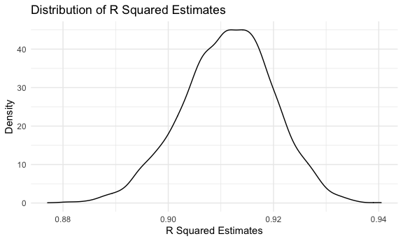

p8105\_hw6\_ly2565
================
Lin Yang
11/29/2021

## Problem 1

### Load and clean the dataset for regression analysis

``` r
birthweight_df = 
  read_csv("data/birthweight.csv") %>% 
  janitor::clean_names() %>% 
  mutate(babysex = as.factor(babysex))

birthweight_df
```

    ## # A tibble: 4,342 × 20
    ##    babysex bhead blength   bwt delwt fincome frace gaweeks malform menarche
    ##    <fct>   <dbl>   <dbl> <dbl> <dbl>   <dbl> <dbl>   <dbl>   <dbl>    <dbl>
    ##  1 2          34      51  3629   177      35     1    39.9       0       13
    ##  2 1          34      48  3062   156      65     2    25.9       0       14
    ##  3 2          36      50  3345   148      85     1    39.9       0       12
    ##  4 1          34      52  3062   157      55     1    40         0       14
    ##  5 2          34      52  3374   156       5     1    41.6       0       13
    ##  6 1          33      52  3374   129      55     1    40.7       0       12
    ##  7 2          33      46  2523   126      96     2    40.3       0       14
    ##  8 2          33      49  2778   140       5     1    37.4       0       12
    ##  9 1          36      52  3515   146      85     1    40.3       0       11
    ## 10 1          33      50  3459   169      75     2    40.7       0       12
    ## # … with 4,332 more rows, and 10 more variables: mheight <dbl>, momage <dbl>,
    ## #   mrace <dbl>, parity <dbl>, pnumlbw <dbl>, pnumsga <dbl>, ppbmi <dbl>,
    ## #   ppwt <dbl>, smoken <dbl>, wtgain <dbl>

### Check for missing values

``` r
map(birthweight_df, ~sum(is.na(.)))
```

    ## $babysex
    ## [1] 0
    ## 
    ## $bhead
    ## [1] 0
    ## 
    ## $blength
    ## [1] 0
    ## 
    ## $bwt
    ## [1] 0
    ## 
    ## $delwt
    ## [1] 0
    ## 
    ## $fincome
    ## [1] 0
    ## 
    ## $frace
    ## [1] 0
    ## 
    ## $gaweeks
    ## [1] 0
    ## 
    ## $malform
    ## [1] 0
    ## 
    ## $menarche
    ## [1] 0
    ## 
    ## $mheight
    ## [1] 0
    ## 
    ## $momage
    ## [1] 0
    ## 
    ## $mrace
    ## [1] 0
    ## 
    ## $parity
    ## [1] 0
    ## 
    ## $pnumlbw
    ## [1] 0
    ## 
    ## $pnumsga
    ## [1] 0
    ## 
    ## $ppbmi
    ## [1] 0
    ## 
    ## $ppwt
    ## [1] 0
    ## 
    ## $smoken
    ## [1] 0
    ## 
    ## $wtgain
    ## [1] 0

There are no missing values in the dataset.

### Propose a regression model for birthweight

``` r
model1 = lm(bwt ~fincome + delwt + momage + pnumlbw + smoken + wtgain, data = birthweight_df)

summary(model1)
```

    ## 
    ## Call:
    ## lm(formula = bwt ~ fincome + delwt + momage + pnumlbw + smoken + 
    ##     wtgain, data = birthweight_df)
    ## 
    ## Residuals:
    ##      Min       1Q   Median       3Q      Max 
    ## -2623.50  -272.39    17.37   302.78  1542.27 
    ## 
    ## Coefficients: (1 not defined because of singularities)
    ##              Estimate Std. Error t value Pr(>|t|)    
    ## (Intercept) 1883.5198    58.7694  32.049  < 2e-16 ***
    ## fincome        2.4660     0.2932   8.410  < 2e-16 ***
    ## delwt          4.7862     0.3609  13.263  < 2e-16 ***
    ## momage        13.6647     1.9842   6.887 6.53e-12 ***
    ## pnumlbw            NA         NA      NA       NA    
    ## smoken        -7.4642     0.9768  -7.642 2.62e-14 ***
    ## wtgain         8.1039     0.7329  11.058  < 2e-16 ***
    ## ---
    ## Signif. codes:  0 '***' 0.001 '**' 0.01 '*' 0.05 '.' 0.1 ' ' 1
    ## 
    ## Residual standard error: 474.1 on 4336 degrees of freedom
    ## Multiple R-squared:  0.1441, Adjusted R-squared:  0.1431 
    ## F-statistic:   146 on 5 and 4336 DF,  p-value: < 2.2e-16

``` r
broom::tidy(model1)
```

    ## # A tibble: 7 × 5
    ##   term        estimate std.error statistic    p.value
    ##   <chr>          <dbl>     <dbl>     <dbl>      <dbl>
    ## 1 (Intercept)  1884.      58.8       32.0   1.85e-202
    ## 2 fincome         2.47     0.293      8.41  5.48e- 17
    ## 3 delwt           4.79     0.361     13.3   2.20e- 39
    ## 4 momage         13.7      1.98       6.89  6.53e- 12
    ## 5 pnumlbw        NA       NA         NA    NA        
    ## 6 smoken         -7.46     0.977     -7.64  2.62e- 14
    ## 7 wtgain          8.10     0.733     11.1   4.75e- 28

Make a plot of model residuals against fitted values.

``` r
birthweight_df %>% 
  add_predictions(model1) %>% 
  add_residuals(model1) %>% 
  ggplot(aes(x = pred, y = resid)) +
  geom_point(alpha = 0.3) +
  geom_smooth(color = "red", method = "lm", se = FALSE)
```

    ## `geom_smooth()` using formula 'y ~ x'



### Fit the other two models

-   One using length at birth and gestational age as predictors (main
    effects only)
-   One using head circumference, length, sex, and all interactions
    (including the three-way interaction) between these

``` r
model2 = lm(bwt ~blength + gaweeks, data = birthweight_df)
summary(model2)
```

    ## 
    ## Call:
    ## lm(formula = bwt ~ blength + gaweeks, data = birthweight_df)
    ## 
    ## Residuals:
    ##     Min      1Q  Median      3Q     Max 
    ## -1709.6  -215.4   -11.4   208.2  4188.8 
    ## 
    ## Coefficients:
    ##              Estimate Std. Error t value Pr(>|t|)    
    ## (Intercept) -4347.667     97.958  -44.38   <2e-16 ***
    ## blength       128.556      1.990   64.60   <2e-16 ***
    ## gaweeks        27.047      1.718   15.74   <2e-16 ***
    ## ---
    ## Signif. codes:  0 '***' 0.001 '**' 0.01 '*' 0.05 '.' 0.1 ' ' 1
    ## 
    ## Residual standard error: 333.2 on 4339 degrees of freedom
    ## Multiple R-squared:  0.5769, Adjusted R-squared:  0.5767 
    ## F-statistic:  2958 on 2 and 4339 DF,  p-value: < 2.2e-16

``` r
broom::tidy(model2)
```

    ## # A tibble: 3 × 5
    ##   term        estimate std.error statistic  p.value
    ##   <chr>          <dbl>     <dbl>     <dbl>    <dbl>
    ## 1 (Intercept)  -4348.      98.0      -44.4 0       
    ## 2 blength        129.       1.99      64.6 0       
    ## 3 gaweeks         27.0      1.72      15.7 2.36e-54

``` r
model3 = lm(bwt ~bhead + blength + babysex + 
                 bhead * blength + bhead * babysex + blength * babysex +
                 bhead * blength * babysex, data = birthweight_df)
summary(model3)
```

    ## 
    ## Call:
    ## lm(formula = bwt ~ bhead + blength + babysex + bhead * blength + 
    ##     bhead * babysex + blength * babysex + bhead * blength * babysex, 
    ##     data = birthweight_df)
    ## 
    ## Residuals:
    ##      Min       1Q   Median       3Q      Max 
    ## -1132.99  -190.42   -10.33   178.63  2617.96 
    ## 
    ## Coefficients:
    ##                          Estimate Std. Error t value Pr(>|t|)    
    ## (Intercept)            -7176.8170  1264.8397  -5.674 1.49e-08 ***
    ## bhead                    181.7956    38.0542   4.777 1.84e-06 ***
    ## blength                  102.1269    26.2118   3.896 9.92e-05 ***
    ## babysex2                6374.8684  1677.7669   3.800 0.000147 ***
    ## bhead:blength             -0.5536     0.7802  -0.710 0.478012    
    ## bhead:babysex2          -198.3932    51.0917  -3.883 0.000105 ***
    ## blength:babysex2        -123.7729    35.1185  -3.524 0.000429 ***
    ## bhead:blength:babysex2     3.8781     1.0566   3.670 0.000245 ***
    ## ---
    ## Signif. codes:  0 '***' 0.001 '**' 0.01 '*' 0.05 '.' 0.1 ' ' 1
    ## 
    ## Residual standard error: 287.7 on 4334 degrees of freedom
    ## Multiple R-squared:  0.6849, Adjusted R-squared:  0.6844 
    ## F-statistic:  1346 on 7 and 4334 DF,  p-value: < 2.2e-16

``` r
broom::tidy(model3)
```

    ## # A tibble: 8 × 5
    ##   term                    estimate std.error statistic      p.value
    ##   <chr>                      <dbl>     <dbl>     <dbl>        <dbl>
    ## 1 (Intercept)            -7177.     1265.       -5.67  0.0000000149
    ## 2 bhead                    182.       38.1       4.78  0.00000184  
    ## 3 blength                  102.       26.2       3.90  0.0000992   
    ## 4 babysex2                6375.     1678.        3.80  0.000147    
    ## 5 bhead:blength             -0.554     0.780    -0.710 0.478       
    ## 6 bhead:babysex2          -198.       51.1      -3.88  0.000105    
    ## 7 blength:babysex2        -124.       35.1      -3.52  0.000429    
    ## 8 bhead:blength:babysex2     3.88      1.06      3.67  0.000245

### Compare the three models in terms of cross validation

``` r
cv_df =
  crossv_mc(birthweight_df, 100) %>% 
  mutate(
    train = map(train, as_tibble),
    test = map(test, as_tibble)) %>% 
  mutate(
    model1 = map(train, ~lm(bwt ~ fincome + delwt + momage + pnumlbw + smoken + wtgain, data = .x)),
    model2 = map(train, ~lm(bwt ~blength + gaweeks, data = .x)),
    model3 = map(train, ~lm(bwt ~bhead + blength + babysex + 
                 bhead * blength + bhead * babysex + blength * babysex +
                 bhead * blength * babysex, data = .x))) %>% 
  mutate(
    rmse_model1 = map2_dbl(model1, test, ~rmse(model = .x, data = .y)),
    rmse_model2 = map2_dbl(model2, test, ~rmse(model = .x, data = .y)),
    rmse_model3 = map2_dbl(model3, test, ~rmse(model = .x, data = .y)))

cv_df 
```

    ## # A tibble: 100 × 9
    ##    train   test   .id   model1 model2 model3 rmse_model1 rmse_model2 rmse_model3
    ##    <list>  <list> <chr> <list> <list> <list>       <dbl>       <dbl>       <dbl>
    ##  1 <tibbl… <tibb… 001   <lm>   <lm>   <lm>          488.        360.        302.
    ##  2 <tibbl… <tibb… 002   <lm>   <lm>   <lm>          483.        322.        280.
    ##  3 <tibbl… <tibb… 003   <lm>   <lm>   <lm>          464.        307.        279.
    ##  4 <tibbl… <tibb… 004   <lm>   <lm>   <lm>          489.        337.        298.
    ##  5 <tibbl… <tibb… 005   <lm>   <lm>   <lm>          490.        367.        303.
    ##  6 <tibbl… <tibb… 006   <lm>   <lm>   <lm>          471.        314.        282.
    ##  7 <tibbl… <tibb… 007   <lm>   <lm>   <lm>          460.        357.        290.
    ##  8 <tibbl… <tibb… 008   <lm>   <lm>   <lm>          472.        346.        301.
    ##  9 <tibbl… <tibb… 009   <lm>   <lm>   <lm>          479.        327.        287.
    ## 10 <tibbl… <tibb… 010   <lm>   <lm>   <lm>          446.        338.        292.
    ## # … with 90 more rows

Make a boxplot showing rmse distribution across 3 models.

``` r
cv_df %>% 
  select(starts_with("rmse")) %>% 
  pivot_longer(
    everything(),
    names_to = "model", 
    values_to = "rmse",
    names_prefix = "rmse_") %>% 
  mutate(model = fct_inorder(model)) %>% 
  ggplot(aes(x = model, y = rmse)) + 
  geom_boxplot()
```


The boxplot indicates that model3 has the lowest prediction error
distribution, and model1 has the highest one. This suggests that model3
is the best fit for birthweight among the three models.

## Problem 2

### Load the 2017 Central Park weather data

``` r
weather_df = 
  rnoaa::meteo_pull_monitors(
    c("USW00094728"),
    var = c("PRCP", "TMIN", "TMAX"), 
    date_min = "2017-01-01",
    date_max = "2017-12-31") %>%
  mutate(
    name = recode(id, USW00094728 = "CentralPark_NY"),
    tmin = tmin / 10,
    tmax = tmax / 10) %>%
  select(name, id, everything())
```

    ## Registered S3 method overwritten by 'hoardr':
    ##   method           from
    ##   print.cache_info httr

    ## using cached file: ~/Library/Caches/R/noaa_ghcnd/USW00094728.dly

    ## date created (size, mb): 2021-10-05 09:46:45 (7.602)

    ## file min/max dates: 1869-01-01 / 2021-10-31

``` r
weather_df
```

    ## # A tibble: 365 × 6
    ##    name           id          date        prcp  tmax  tmin
    ##    <chr>          <chr>       <date>     <dbl> <dbl> <dbl>
    ##  1 CentralPark_NY USW00094728 2017-01-01     0   8.9   4.4
    ##  2 CentralPark_NY USW00094728 2017-01-02    53   5     2.8
    ##  3 CentralPark_NY USW00094728 2017-01-03   147   6.1   3.9
    ##  4 CentralPark_NY USW00094728 2017-01-04     0  11.1   1.1
    ##  5 CentralPark_NY USW00094728 2017-01-05     0   1.1  -2.7
    ##  6 CentralPark_NY USW00094728 2017-01-06    13   0.6  -3.8
    ##  7 CentralPark_NY USW00094728 2017-01-07    81  -3.2  -6.6
    ##  8 CentralPark_NY USW00094728 2017-01-08     0  -3.8  -8.8
    ##  9 CentralPark_NY USW00094728 2017-01-09     0  -4.9  -9.9
    ## 10 CentralPark_NY USW00094728 2017-01-10     0   7.8  -6  
    ## # … with 355 more rows

Draw 5000 bootstrap samples.

``` r
boot_strap_df = 
  weather_df %>% 
  bootstrap(n = 5000)

boot_strap_df
```

    ## # A tibble: 5,000 × 2
    ##    strap                .id  
    ##    <list>               <chr>
    ##  1 <resample [365 x 6]> 0001 
    ##  2 <resample [365 x 6]> 0002 
    ##  3 <resample [365 x 6]> 0003 
    ##  4 <resample [365 x 6]> 0004 
    ##  5 <resample [365 x 6]> 0005 
    ##  6 <resample [365 x 6]> 0006 
    ##  7 <resample [365 x 6]> 0007 
    ##  8 <resample [365 x 6]> 0008 
    ##  9 <resample [365 x 6]> 0009 
    ## 10 <resample [365 x 6]> 0010 
    ## # … with 4,990 more rows

``` r
r_squared_results = 
  boot_strap_df %>% 
  mutate(
    models = map(strap, ~lm(tmax ~ tmin, data = .x)),
    results = map(models, broom::glance)) %>%
  select(-strap, -models) %>% 
  unnest(results)

r_squared_results %>% 
  ggplot(aes(x = adj.r.squared)) +
  geom_density()
```



``` r
r_squared_results %>% 
  summarize(
    ci_lower = quantile(r.squared, 0.025),
    ci_upper = quantile(r.squared, 0.975)) %>% 
  knitr::kable()
```

| ci\_lower | ci\_upper |
|----------:|----------:|
| 0.8936977 | 0.9274807 |

``` r
log_results = 
  boot_strap_df %>% 
  mutate(
    models = map(strap, ~lm(tmax ~ tmin, data = .x)),
    results = map(models, broom::tidy)) %>%
  select(-strap, -models) %>% 
  unnest(results)

beta_0 = 
  log_results %>% 
  filter(term == "(Intercept)") %>% 
  rename(beta_0_est = estimate)

beta_1 = 
  log_results %>% 
  filter(term == "tmin") %>% 
  rename(beta_1_est = estimate)

df = 
  left_join(beta_0, beta_1, by = ".id") %>% 
  select(.id, beta_0_est, beta_1_est) %>% 
  mutate(log = log(beta_0_est * beta_1_est)) %>% 
  ggplot(aes(x = log)) +
  geom_density()
```
