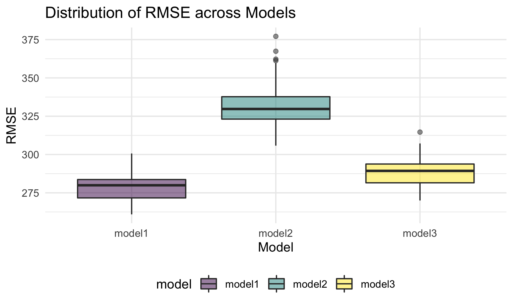

p8105\_hw6\_ly2565
================
Lin Yang
11/29/2021

## Problem 1

### Load and clean the dataset for regression analysis

``` r
birthweight_df = 
  read_csv("data/birthweight.csv") %>% 
  janitor::clean_names() %>%
  mutate(
    babysex = as.factor(babysex),
    babysex = fct_recode(babysex, "male" = "1", "female" = "2"),
    frace = as.factor(frace),
    frace = fct_recode(frace, "white" = "1", "black" = "2", "asian" = "3", 
                       "puerto rican" = "4", "other" = "8", "unknown" = "9"),
    malform = as.logical(malform),
    mrace = as.factor(mrace),
    mrace = fct_recode(mrace, "white" = "1", "black" = "2", "asian" = "3", 
                       "puerto rican" = "4", "other" = "8", "unknown" = "9"))
  

birthweight_df 
```

    ## # A tibble: 4,342 × 20
    ##    babysex bhead blength   bwt delwt fincome frace gaweeks malform menarche
    ##    <fct>   <dbl>   <dbl> <dbl> <dbl>   <dbl> <fct>   <dbl> <lgl>      <dbl>
    ##  1 female     34      51  3629   177      35 white    39.9 FALSE         13
    ##  2 male       34      48  3062   156      65 black    25.9 FALSE         14
    ##  3 female     36      50  3345   148      85 white    39.9 FALSE         12
    ##  4 male       34      52  3062   157      55 white    40   FALSE         14
    ##  5 female     34      52  3374   156       5 white    41.6 FALSE         13
    ##  6 male       33      52  3374   129      55 white    40.7 FALSE         12
    ##  7 female     33      46  2523   126      96 black    40.3 FALSE         14
    ##  8 female     33      49  2778   140       5 white    37.4 FALSE         12
    ##  9 male       36      52  3515   146      85 white    40.3 FALSE         11
    ## 10 male       33      50  3459   169      75 black    40.7 FALSE         12
    ## # … with 4,332 more rows, and 10 more variables: mheight <dbl>, momage <dbl>,
    ## #   mrace <fct>, parity <dbl>, pnumlbw <dbl>, pnumsga <dbl>, ppbmi <dbl>,
    ## #   ppwt <dbl>, smoken <dbl>, wtgain <dbl>

### Check for missing values

``` r
map(birthweight_df, ~sum(is.na(.)))
```

    ## $babysex
    ## [1] 0
    ## 
    ## $bhead
    ## [1] 0
    ## 
    ## $blength
    ## [1] 0
    ## 
    ## $bwt
    ## [1] 0
    ## 
    ## $delwt
    ## [1] 0
    ## 
    ## $fincome
    ## [1] 0
    ## 
    ## $frace
    ## [1] 0
    ## 
    ## $gaweeks
    ## [1] 0
    ## 
    ## $malform
    ## [1] 0
    ## 
    ## $menarche
    ## [1] 0
    ## 
    ## $mheight
    ## [1] 0
    ## 
    ## $momage
    ## [1] 0
    ## 
    ## $mrace
    ## [1] 0
    ## 
    ## $parity
    ## [1] 0
    ## 
    ## $pnumlbw
    ## [1] 0
    ## 
    ## $pnumsga
    ## [1] 0
    ## 
    ## $ppbmi
    ## [1] 0
    ## 
    ## $ppwt
    ## [1] 0
    ## 
    ## $smoken
    ## [1] 0
    ## 
    ## $wtgain
    ## [1] 0

There are no missing values in the dataset.

### Propose a regression model for birthweight

I built a regression model using a model selection approach called
*Backward Elimination* which starts with all predictors in the model and
then removes one predictor with the highest p value at a time until all
p values are smaller than 0.05.

``` r
#fit regression model using all predictors
fit_all = lm(bwt ~ ., data = birthweight_df)
summary(fit_all)
```

    ## 
    ## Call:
    ## lm(formula = bwt ~ ., data = birthweight_df)
    ## 
    ## Residuals:
    ##      Min       1Q   Median       3Q      Max 
    ## -1097.68  -184.86    -3.33   173.09  2344.15 
    ## 
    ## Coefficients: (3 not defined because of singularities)
    ##                     Estimate Std. Error t value Pr(>|t|)    
    ## (Intercept)       -6265.3914   660.4011  -9.487  < 2e-16 ***
    ## babysexfemale        28.7073     8.4652   3.391 0.000702 ***
    ## bhead               130.7781     3.4523  37.881  < 2e-16 ***
    ## blength              74.9536     2.0217  37.075  < 2e-16 ***
    ## delwt                 4.1007     0.3948  10.386  < 2e-16 ***
    ## fincome               0.2898     0.1795   1.614 0.106551    
    ## fraceblack           14.3313    46.1501   0.311 0.756168    
    ## fraceasian           21.2361    69.2960   0.306 0.759273    
    ## fracepuerto rican   -46.9962    44.6782  -1.052 0.292912    
    ## fraceother            4.2969    74.0741   0.058 0.953745    
    ## gaweeks              11.5494     1.4654   7.882 4.06e-15 ***
    ## malformTRUE           9.7650    70.6259   0.138 0.890039    
    ## menarche             -3.5508     2.8951  -1.226 0.220083    
    ## mheight               9.7874    10.3116   0.949 0.342588    
    ## momage                0.7593     1.2221   0.621 0.534418    
    ## mraceblack         -151.4354    46.0453  -3.289 0.001014 ** 
    ## mraceasian          -91.3866    71.9190  -1.271 0.203908    
    ## mracepuerto rican   -56.4787    45.1369  -1.251 0.210901    
    ## parity               95.5411    40.4793   2.360 0.018307 *  
    ## pnumlbw                   NA         NA      NA       NA    
    ## pnumsga                   NA         NA      NA       NA    
    ## ppbmi                 4.3538    14.8913   0.292 0.770017    
    ## ppwt                 -3.4716     2.6121  -1.329 0.183913    
    ## smoken               -4.8544     0.5871  -8.269  < 2e-16 ***
    ## wtgain                    NA         NA      NA       NA    
    ## ---
    ## Signif. codes:  0 '***' 0.001 '**' 0.01 '*' 0.05 '.' 0.1 ' ' 1
    ## 
    ## Residual standard error: 272.5 on 4320 degrees of freedom
    ## Multiple R-squared:  0.7183, Adjusted R-squared:  0.717 
    ## F-statistic: 524.6 on 21 and 4320 DF,  p-value: < 2.2e-16

``` r
#pnumlbw and pnumsga show NA, check unique values in the two columns
unique(pull(birthweight_df, pnumlbw))
```

    ## [1] 0

``` r
unique(pull(birthweight_df, pnumsga))
```

    ## [1] 0

``` r
#no pnumlbw
step1 = update(fit_all, . ~ . -pnumlbw)
summary(step1)
```

    ## 
    ## Call:
    ## lm(formula = bwt ~ babysex + bhead + blength + delwt + fincome + 
    ##     frace + gaweeks + malform + menarche + mheight + momage + 
    ##     mrace + parity + pnumsga + ppbmi + ppwt + smoken + wtgain, 
    ##     data = birthweight_df)
    ## 
    ## Residuals:
    ##      Min       1Q   Median       3Q      Max 
    ## -1097.68  -184.86    -3.33   173.09  2344.15 
    ## 
    ## Coefficients: (2 not defined because of singularities)
    ##                     Estimate Std. Error t value Pr(>|t|)    
    ## (Intercept)       -6265.3914   660.4011  -9.487  < 2e-16 ***
    ## babysexfemale        28.7073     8.4652   3.391 0.000702 ***
    ## bhead               130.7781     3.4523  37.881  < 2e-16 ***
    ## blength              74.9536     2.0217  37.075  < 2e-16 ***
    ## delwt                 4.1007     0.3948  10.386  < 2e-16 ***
    ## fincome               0.2898     0.1795   1.614 0.106551    
    ## fraceblack           14.3313    46.1501   0.311 0.756168    
    ## fraceasian           21.2361    69.2960   0.306 0.759273    
    ## fracepuerto rican   -46.9962    44.6782  -1.052 0.292912    
    ## fraceother            4.2969    74.0741   0.058 0.953745    
    ## gaweeks              11.5494     1.4654   7.882 4.06e-15 ***
    ## malformTRUE           9.7650    70.6259   0.138 0.890039    
    ## menarche             -3.5508     2.8951  -1.226 0.220083    
    ## mheight               9.7874    10.3116   0.949 0.342588    
    ## momage                0.7593     1.2221   0.621 0.534418    
    ## mraceblack         -151.4354    46.0453  -3.289 0.001014 ** 
    ## mraceasian          -91.3866    71.9190  -1.271 0.203908    
    ## mracepuerto rican   -56.4787    45.1369  -1.251 0.210901    
    ## parity               95.5411    40.4793   2.360 0.018307 *  
    ## pnumsga                   NA         NA      NA       NA    
    ## ppbmi                 4.3538    14.8913   0.292 0.770017    
    ## ppwt                 -3.4716     2.6121  -1.329 0.183913    
    ## smoken               -4.8544     0.5871  -8.269  < 2e-16 ***
    ## wtgain                    NA         NA      NA       NA    
    ## ---
    ## Signif. codes:  0 '***' 0.001 '**' 0.01 '*' 0.05 '.' 0.1 ' ' 1
    ## 
    ## Residual standard error: 272.5 on 4320 degrees of freedom
    ## Multiple R-squared:  0.7183, Adjusted R-squared:  0.717 
    ## F-statistic: 524.6 on 21 and 4320 DF,  p-value: < 2.2e-16

``` r
#no pnumsga
step2 = update(step1, . ~ . -pnumsga)
summary(step2)
```

    ## 
    ## Call:
    ## lm(formula = bwt ~ babysex + bhead + blength + delwt + fincome + 
    ##     frace + gaweeks + malform + menarche + mheight + momage + 
    ##     mrace + parity + ppbmi + ppwt + smoken + wtgain, data = birthweight_df)
    ## 
    ## Residuals:
    ##      Min       1Q   Median       3Q      Max 
    ## -1097.68  -184.86    -3.33   173.09  2344.15 
    ## 
    ## Coefficients: (1 not defined because of singularities)
    ##                     Estimate Std. Error t value Pr(>|t|)    
    ## (Intercept)       -6265.3914   660.4011  -9.487  < 2e-16 ***
    ## babysexfemale        28.7073     8.4652   3.391 0.000702 ***
    ## bhead               130.7781     3.4523  37.881  < 2e-16 ***
    ## blength              74.9536     2.0217  37.075  < 2e-16 ***
    ## delwt                 4.1007     0.3948  10.386  < 2e-16 ***
    ## fincome               0.2898     0.1795   1.614 0.106551    
    ## fraceblack           14.3313    46.1501   0.311 0.756168    
    ## fraceasian           21.2361    69.2960   0.306 0.759273    
    ## fracepuerto rican   -46.9962    44.6782  -1.052 0.292912    
    ## fraceother            4.2969    74.0741   0.058 0.953745    
    ## gaweeks              11.5494     1.4654   7.882 4.06e-15 ***
    ## malformTRUE           9.7650    70.6259   0.138 0.890039    
    ## menarche             -3.5508     2.8951  -1.226 0.220083    
    ## mheight               9.7874    10.3116   0.949 0.342588    
    ## momage                0.7593     1.2221   0.621 0.534418    
    ## mraceblack         -151.4354    46.0453  -3.289 0.001014 ** 
    ## mraceasian          -91.3866    71.9190  -1.271 0.203908    
    ## mracepuerto rican   -56.4787    45.1369  -1.251 0.210901    
    ## parity               95.5411    40.4793   2.360 0.018307 *  
    ## ppbmi                 4.3538    14.8913   0.292 0.770017    
    ## ppwt                 -3.4716     2.6121  -1.329 0.183913    
    ## smoken               -4.8544     0.5871  -8.269  < 2e-16 ***
    ## wtgain                    NA         NA      NA       NA    
    ## ---
    ## Signif. codes:  0 '***' 0.001 '**' 0.01 '*' 0.05 '.' 0.1 ' ' 1
    ## 
    ## Residual standard error: 272.5 on 4320 degrees of freedom
    ## Multiple R-squared:  0.7183, Adjusted R-squared:  0.717 
    ## F-statistic: 524.6 on 21 and 4320 DF,  p-value: < 2.2e-16

``` r
#no wtgain
step3 = update(step2, . ~ . -wtgain)
summary(step3)
```

    ## 
    ## Call:
    ## lm(formula = bwt ~ babysex + bhead + blength + delwt + fincome + 
    ##     frace + gaweeks + malform + menarche + mheight + momage + 
    ##     mrace + parity + ppbmi + ppwt + smoken, data = birthweight_df)
    ## 
    ## Residuals:
    ##      Min       1Q   Median       3Q      Max 
    ## -1097.68  -184.86    -3.33   173.09  2344.15 
    ## 
    ## Coefficients:
    ##                     Estimate Std. Error t value Pr(>|t|)    
    ## (Intercept)       -6265.3914   660.4011  -9.487  < 2e-16 ***
    ## babysexfemale        28.7073     8.4652   3.391 0.000702 ***
    ## bhead               130.7781     3.4523  37.881  < 2e-16 ***
    ## blength              74.9536     2.0217  37.075  < 2e-16 ***
    ## delwt                 4.1007     0.3948  10.386  < 2e-16 ***
    ## fincome               0.2898     0.1795   1.614 0.106551    
    ## fraceblack           14.3313    46.1501   0.311 0.756168    
    ## fraceasian           21.2361    69.2960   0.306 0.759273    
    ## fracepuerto rican   -46.9962    44.6782  -1.052 0.292912    
    ## fraceother            4.2969    74.0741   0.058 0.953745    
    ## gaweeks              11.5494     1.4654   7.882 4.06e-15 ***
    ## malformTRUE           9.7650    70.6259   0.138 0.890039    
    ## menarche             -3.5508     2.8951  -1.226 0.220083    
    ## mheight               9.7874    10.3116   0.949 0.342588    
    ## momage                0.7593     1.2221   0.621 0.534418    
    ## mraceblack         -151.4354    46.0453  -3.289 0.001014 ** 
    ## mraceasian          -91.3866    71.9190  -1.271 0.203908    
    ## mracepuerto rican   -56.4787    45.1369  -1.251 0.210901    
    ## parity               95.5411    40.4793   2.360 0.018307 *  
    ## ppbmi                 4.3538    14.8913   0.292 0.770017    
    ## ppwt                 -3.4716     2.6121  -1.329 0.183913    
    ## smoken               -4.8544     0.5871  -8.269  < 2e-16 ***
    ## ---
    ## Signif. codes:  0 '***' 0.001 '**' 0.01 '*' 0.05 '.' 0.1 ' ' 1
    ## 
    ## Residual standard error: 272.5 on 4320 degrees of freedom
    ## Multiple R-squared:  0.7183, Adjusted R-squared:  0.717 
    ## F-statistic: 524.6 on 21 and 4320 DF,  p-value: < 2.2e-16

``` r
#no frace
step4 = update(step3, . ~ . -frace)
summary(step4)
```

    ## 
    ## Call:
    ## lm(formula = bwt ~ babysex + bhead + blength + delwt + fincome + 
    ##     gaweeks + malform + menarche + mheight + momage + mrace + 
    ##     parity + ppbmi + ppwt + smoken, data = birthweight_df)
    ## 
    ## Residuals:
    ##     Min      1Q  Median      3Q     Max 
    ## -1097.2  -185.0    -3.4   173.5  2343.0 
    ## 
    ## Coefficients:
    ##                     Estimate Std. Error t value Pr(>|t|)    
    ## (Intercept)       -6275.7539   660.1055  -9.507  < 2e-16 ***
    ## babysexfemale        28.6774     8.4624   3.389 0.000708 ***
    ## bhead               130.7957     3.4498  37.914  < 2e-16 ***
    ## blength              74.9120     2.0205  37.075  < 2e-16 ***
    ## delwt                 4.0999     0.3945  10.392  < 2e-16 ***
    ## fincome               0.2900     0.1792   1.619 0.105601    
    ## gaweeks              11.5653     1.4649   7.895 3.65e-15 ***
    ## malformTRUE           9.8604    70.6042   0.140 0.888937    
    ## menarche             -3.6117     2.8923  -1.249 0.211826    
    ## mheight               9.9748    10.3066   0.968 0.333191    
    ## momage                0.7549     1.2207   0.618 0.536323    
    ## mraceblack         -137.2032    10.2150 -13.432  < 2e-16 ***
    ## mraceasian          -73.8582    42.7892  -1.726 0.084402 .  
    ## mracepuerto rican   -99.1585    19.3862  -5.115 3.28e-07 ***
    ## parity               95.6671    40.4678   2.364 0.018121 *  
    ## ppbmi                 4.5635    14.8839   0.307 0.759159    
    ## ppwt                 -3.5082     2.6110  -1.344 0.179136    
    ## smoken               -4.8281     0.5860  -8.239 2.29e-16 ***
    ## ---
    ## Signif. codes:  0 '***' 0.001 '**' 0.01 '*' 0.05 '.' 0.1 ' ' 1
    ## 
    ## Residual standard error: 272.4 on 4324 degrees of freedom
    ## Multiple R-squared:  0.7182, Adjusted R-squared:  0.7171 
    ## F-statistic: 648.3 on 17 and 4324 DF,  p-value: < 2.2e-16

``` r
#no malform
step5 = update(step4, . ~ . -malform)
summary(step5)
```

    ## 
    ## Call:
    ## lm(formula = bwt ~ babysex + bhead + blength + delwt + fincome + 
    ##     gaweeks + menarche + mheight + momage + mrace + parity + 
    ##     ppbmi + ppwt + smoken, data = birthweight_df)
    ## 
    ## Residuals:
    ##      Min       1Q   Median       3Q      Max 
    ## -1097.12  -184.99    -3.41   173.48  2342.82 
    ## 
    ## Coefficients:
    ##                     Estimate Std. Error t value Pr(>|t|)    
    ## (Intercept)       -6274.6909   659.9868  -9.507  < 2e-16 ***
    ## babysexfemale        28.6599     8.4605   3.387 0.000712 ***
    ## bhead               130.7994     3.4493  37.920  < 2e-16 ***
    ## blength              74.9075     2.0201  37.082  < 2e-16 ***
    ## delwt                 4.1017     0.3943  10.403  < 2e-16 ***
    ## fincome               0.2895     0.1791   1.616 0.106120    
    ## gaweeks              11.5632     1.4646   7.895 3.65e-15 ***
    ## menarche             -3.6164     2.8917  -1.251 0.211146    
    ## mheight               9.9613    10.3049   0.967 0.333773    
    ## momage                0.7585     1.2203   0.622 0.534265    
    ## mraceblack         -137.2323    10.2117 -13.439  < 2e-16 ***
    ## mraceasian          -73.9192    42.7821  -1.728 0.084094 .  
    ## mracepuerto rican   -99.2152    19.3798  -5.120 3.20e-07 ***
    ## parity               95.6426    40.4629   2.364 0.018137 *  
    ## ppbmi                 4.5479    14.8818   0.306 0.759922    
    ## ppwt                 -3.5073     2.6106  -1.343 0.179197    
    ## smoken               -4.8262     0.5858  -8.239 2.29e-16 ***
    ## ---
    ## Signif. codes:  0 '***' 0.001 '**' 0.01 '*' 0.05 '.' 0.1 ' ' 1
    ## 
    ## Residual standard error: 272.4 on 4325 degrees of freedom
    ## Multiple R-squared:  0.7182, Adjusted R-squared:  0.7172 
    ## F-statistic:   689 on 16 and 4325 DF,  p-value: < 2.2e-16

``` r
#no ppbmi
step6 = update(step5, . ~ . -ppbmi)
summary(step6)
```

    ## 
    ## Call:
    ## lm(formula = bwt ~ babysex + bhead + blength + delwt + fincome + 
    ##     gaweeks + menarche + mheight + momage + mrace + parity + 
    ##     ppwt + smoken, data = birthweight_df)
    ## 
    ## Residuals:
    ##      Min       1Q   Median       3Q      Max 
    ## -1095.57  -185.07    -3.22   173.66  2342.79 
    ## 
    ## Coefficients:
    ##                     Estimate Std. Error t value Pr(>|t|)    
    ## (Intercept)       -6077.6038   140.2391 -43.337  < 2e-16 ***
    ## babysexfemale        28.6376     8.4593   3.385 0.000717 ***
    ## bhead               130.8308     3.4474  37.950  < 2e-16 ***
    ## blength              74.9102     2.0198  37.087  < 2e-16 ***
    ## delwt                 4.1004     0.3942  10.402  < 2e-16 ***
    ## fincome               0.2905     0.1791   1.622 0.104816    
    ## gaweeks              11.5597     1.4644   7.894 3.69e-15 ***
    ## menarche             -3.6401     2.8904  -1.259 0.207963    
    ## mheight               6.8604     1.7989   3.814 0.000139 ***
    ## momage                0.7656     1.2199   0.628 0.530319    
    ## mraceblack         -137.2019    10.2102 -13.438  < 2e-16 ***
    ## mraceasian          -74.6165    42.7167  -1.747 0.080747 .  
    ## mracepuerto rican   -99.4288    19.3652  -5.134 2.95e-07 ***
    ## parity               95.4592    40.4542   2.360 0.018335 *  
    ## ppwt                 -2.7205     0.4325  -6.290 3.50e-10 ***
    ## smoken               -4.8279     0.5857  -8.243  < 2e-16 ***
    ## ---
    ## Signif. codes:  0 '***' 0.001 '**' 0.01 '*' 0.05 '.' 0.1 ' ' 1
    ## 
    ## Residual standard error: 272.3 on 4326 degrees of freedom
    ## Multiple R-squared:  0.7182, Adjusted R-squared:  0.7172 
    ## F-statistic: 735.1 on 15 and 4326 DF,  p-value: < 2.2e-16

``` r
#no momage
step7 = update(step6, . ~ . -momage)
summary(step7)
```

    ## 
    ## Call:
    ## lm(formula = bwt ~ babysex + bhead + blength + delwt + fincome + 
    ##     gaweeks + menarche + mheight + mrace + parity + ppwt + smoken, 
    ##     data = birthweight_df)
    ## 
    ## Residuals:
    ##      Min       1Q   Median       3Q      Max 
    ## -1096.14  -184.98    -2.86   173.65  2343.59 
    ## 
    ## Coefficients:
    ##                     Estimate Std. Error t value Pr(>|t|)    
    ## (Intercept)       -6070.1897   139.7308 -43.442  < 2e-16 ***
    ## babysexfemale        28.4769     8.4548   3.368 0.000763 ***
    ## bhead               130.8513     3.4470  37.961  < 2e-16 ***
    ## blength              74.8931     2.0195  37.085  < 2e-16 ***
    ## delwt                 4.0794     0.3927  10.387  < 2e-16 ***
    ## fincome               0.3149     0.1748   1.802 0.071621 .  
    ## gaweeks              11.6105     1.4621   7.941 2.54e-15 ***
    ## menarche             -3.2979     2.8383  -1.162 0.245327    
    ## mheight               6.8542     1.7988   3.810 0.000141 ***
    ## mraceblack         -138.7506     9.9068 -14.006  < 2e-16 ***
    ## mraceasian          -71.4559    42.4158  -1.685 0.092128 .  
    ## mracepuerto rican  -100.1555    19.3291  -5.182 2.30e-07 ***
    ## parity               97.3088    40.3438   2.412 0.015907 *  
    ## ppwt                 -2.6787     0.4273  -6.268 4.01e-10 ***
    ## smoken               -4.8305     0.5857  -8.248  < 2e-16 ***
    ## ---
    ## Signif. codes:  0 '***' 0.001 '**' 0.01 '*' 0.05 '.' 0.1 ' ' 1
    ## 
    ## Residual standard error: 272.3 on 4327 degrees of freedom
    ## Multiple R-squared:  0.7182, Adjusted R-squared:  0.7173 
    ## F-statistic: 787.7 on 14 and 4327 DF,  p-value: < 2.2e-16

``` r
#no menarche
step8 = update(step7, . ~ . -menarche)
summary(step8)
```

    ## 
    ## Call:
    ## lm(formula = bwt ~ babysex + bhead + blength + delwt + fincome + 
    ##     gaweeks + mheight + mrace + parity + ppwt + smoken, data = birthweight_df)
    ## 
    ## Residuals:
    ##      Min       1Q   Median       3Q      Max 
    ## -1097.18  -185.52    -3.39   174.14  2353.44 
    ## 
    ## Coefficients:
    ##                     Estimate Std. Error t value Pr(>|t|)    
    ## (Intercept)       -6098.8219   137.5463 -44.340  < 2e-16 ***
    ## babysexfemale        28.5580     8.4549   3.378 0.000737 ***
    ## bhead               130.7770     3.4466  37.944  < 2e-16 ***
    ## blength              74.9471     2.0190  37.120  < 2e-16 ***
    ## delwt                 4.1067     0.3921  10.475  < 2e-16 ***
    ## fincome               0.3180     0.1747   1.820 0.068844 .  
    ## gaweeks              11.5925     1.4621   7.929 2.79e-15 ***
    ## mheight               6.5940     1.7849   3.694 0.000223 ***
    ## mraceblack         -138.7925     9.9071 -14.009  < 2e-16 ***
    ## mraceasian          -74.8868    42.3146  -1.770 0.076837 .  
    ## mracepuerto rican  -100.6781    19.3247  -5.210 1.98e-07 ***
    ## parity               96.3047    40.3362   2.388 0.017004 *  
    ## ppwt                 -2.6756     0.4274  -6.261 4.20e-10 ***
    ## smoken               -4.8434     0.5856  -8.271  < 2e-16 ***
    ## ---
    ## Signif. codes:  0 '***' 0.001 '**' 0.01 '*' 0.05 '.' 0.1 ' ' 1
    ## 
    ## Residual standard error: 272.3 on 4328 degrees of freedom
    ## Multiple R-squared:  0.7181, Adjusted R-squared:  0.7173 
    ## F-statistic: 848.1 on 13 and 4328 DF,  p-value: < 2.2e-16

``` r
#no mrace
step9 = update(step8, . ~ . -mrace)
summary(step9)
```

    ## 
    ## Call:
    ## lm(formula = bwt ~ babysex + bhead + blength + delwt + fincome + 
    ##     gaweeks + mheight + parity + ppwt + smoken, data = birthweight_df)
    ## 
    ## Residuals:
    ##      Min       1Q   Median       3Q      Max 
    ## -1086.86  -180.66    -5.85   175.33  2524.46 
    ## 
    ## Coefficients:
    ##                 Estimate Std. Error t value Pr(>|t|)    
    ## (Intercept)   -6596.2111   134.9699 -48.872  < 2e-16 ***
    ## babysexfemale    29.9526     8.6308   3.470 0.000525 ***
    ## bhead           134.6172     3.5025  38.435  < 2e-16 ***
    ## blength          77.6256     2.0548  37.779  < 2e-16 ***
    ## delwt             3.8538     0.4001   9.633  < 2e-16 ***
    ## fincome           1.2231     0.1661   7.365 2.11e-13 ***
    ## gaweeks          13.1753     1.4897   8.844  < 2e-16 ***
    ## mheight           8.0715     1.7886   4.513 6.57e-06 ***
    ## parity          104.0734    41.2279   2.524 0.011627 *  
    ## ppwt             -2.6870     0.4365  -6.155 8.18e-10 ***
    ## smoken           -2.6944     0.5775  -4.666 3.17e-06 ***
    ## ---
    ## Signif. codes:  0 '***' 0.001 '**' 0.01 '*' 0.05 '.' 0.1 ' ' 1
    ## 
    ## Residual standard error: 278.4 on 4331 degrees of freedom
    ## Multiple R-squared:  0.7052, Adjusted R-squared:  0.7045 
    ## F-statistic:  1036 on 10 and 4331 DF,  p-value: < 2.2e-16

Using the Backward Elimination approach, I first removed variables,
`pnumlbw`, `pnumsga`, `wtgain` which returned NA for all estimates. The
reason why `wtgain` showed NA might be that it highly correlated with
other variables, like `delwt`: mother’s weight at delivery and `ppwt`:
mother’s pre-pregnancy weight. In terms of `pnumlbw` and `pnumsga`, they
returned NA because there were only values of 0 in the two columns.

After removing all non-significant predictors, I fitted a regression
model for baby birthweight based on predictors: `babysex`, `bhead`,
`blength`, `delwt`, `fincome`, `gaweeks`, `mheight`, `parity`, `ppwt`,
and `smoken`.

``` r
model1 = lm(bwt ~babysex + bhead + blength + delwt + fincome + gaweeks + mheight + parity + ppwt + smoken, data = birthweight_df)

summary(model1)
```

    ## 
    ## Call:
    ## lm(formula = bwt ~ babysex + bhead + blength + delwt + fincome + 
    ##     gaweeks + mheight + parity + ppwt + smoken, data = birthweight_df)
    ## 
    ## Residuals:
    ##      Min       1Q   Median       3Q      Max 
    ## -1086.86  -180.66    -5.85   175.33  2524.46 
    ## 
    ## Coefficients:
    ##                 Estimate Std. Error t value Pr(>|t|)    
    ## (Intercept)   -6596.2111   134.9699 -48.872  < 2e-16 ***
    ## babysexfemale    29.9526     8.6308   3.470 0.000525 ***
    ## bhead           134.6172     3.5025  38.435  < 2e-16 ***
    ## blength          77.6256     2.0548  37.779  < 2e-16 ***
    ## delwt             3.8538     0.4001   9.633  < 2e-16 ***
    ## fincome           1.2231     0.1661   7.365 2.11e-13 ***
    ## gaweeks          13.1753     1.4897   8.844  < 2e-16 ***
    ## mheight           8.0715     1.7886   4.513 6.57e-06 ***
    ## parity          104.0734    41.2279   2.524 0.011627 *  
    ## ppwt             -2.6870     0.4365  -6.155 8.18e-10 ***
    ## smoken           -2.6944     0.5775  -4.666 3.17e-06 ***
    ## ---
    ## Signif. codes:  0 '***' 0.001 '**' 0.01 '*' 0.05 '.' 0.1 ' ' 1
    ## 
    ## Residual standard error: 278.4 on 4331 degrees of freedom
    ## Multiple R-squared:  0.7052, Adjusted R-squared:  0.7045 
    ## F-statistic:  1036 on 10 and 4331 DF,  p-value: < 2.2e-16

``` r
broom::tidy(model1)
```

    ## # A tibble: 11 × 5
    ##    term          estimate std.error statistic   p.value
    ##    <chr>            <dbl>     <dbl>     <dbl>     <dbl>
    ##  1 (Intercept)   -6596.     135.       -48.9  0        
    ##  2 babysexfemale    30.0      8.63       3.47 5.25e-  4
    ##  3 bhead           135.       3.50      38.4  2.36e-278
    ##  4 blength          77.6      2.05      37.8  3.27e-270
    ##  5 delwt             3.85     0.400      9.63 9.59e- 22
    ##  6 fincome           1.22     0.166      7.37 2.11e- 13
    ##  7 gaweeks          13.2      1.49       8.84 1.32e- 18
    ##  8 mheight           8.07     1.79       4.51 6.57e-  6
    ##  9 parity          104.      41.2        2.52 1.16e-  2
    ## 10 ppwt             -2.69     0.437     -6.16 8.18e- 10
    ## 11 smoken           -2.69     0.577     -4.67 3.17e-  6

Make a plot of model residuals against fitted values.

``` r
birthweight_df %>% 
  add_predictions(model1) %>% 
  add_residuals(model1) %>% 
  ggplot(aes(x = pred, y = resid)) +
  geom_point(alpha = 0.2) +
  geom_smooth(color = "red", method = "lm", se = FALSE) +
  labs(
    x = "Predicted Values",
    y = "Residuals",
    title = "Residuals vs Predicted Values"
  )
```


Based on this plot, residual values appear to be evenly distributed
around 0, indicating constant variance of residuals. However, there are
two predicted values less than 0, which may be outliers, and there are
two obvious outliers with residuals over 2000.

### Fit the other two models

-   One using length at birth and gestational age as predictors (main
    effects only)
-   One using head circumference, length, sex, and all interactions
    (including the three-way interaction) between these

``` r
model2 = lm(bwt ~blength + gaweeks, data = birthweight_df)
summary(model2)
```

    ## 
    ## Call:
    ## lm(formula = bwt ~ blength + gaweeks, data = birthweight_df)
    ## 
    ## Residuals:
    ##     Min      1Q  Median      3Q     Max 
    ## -1709.6  -215.4   -11.4   208.2  4188.8 
    ## 
    ## Coefficients:
    ##              Estimate Std. Error t value Pr(>|t|)    
    ## (Intercept) -4347.667     97.958  -44.38   <2e-16 ***
    ## blength       128.556      1.990   64.60   <2e-16 ***
    ## gaweeks        27.047      1.718   15.74   <2e-16 ***
    ## ---
    ## Signif. codes:  0 '***' 0.001 '**' 0.01 '*' 0.05 '.' 0.1 ' ' 1
    ## 
    ## Residual standard error: 333.2 on 4339 degrees of freedom
    ## Multiple R-squared:  0.5769, Adjusted R-squared:  0.5767 
    ## F-statistic:  2958 on 2 and 4339 DF,  p-value: < 2.2e-16

``` r
broom::tidy(model2)
```

    ## # A tibble: 3 × 5
    ##   term        estimate std.error statistic  p.value
    ##   <chr>          <dbl>     <dbl>     <dbl>    <dbl>
    ## 1 (Intercept)  -4348.      98.0      -44.4 0       
    ## 2 blength        129.       1.99      64.6 0       
    ## 3 gaweeks         27.0      1.72      15.7 2.36e-54

``` r
model3 = lm(bwt ~bhead + blength + babysex + 
                 bhead * blength + bhead * babysex + blength * babysex +
                 bhead * blength * babysex, data = birthweight_df)
summary(model3)
```

    ## 
    ## Call:
    ## lm(formula = bwt ~ bhead + blength + babysex + bhead * blength + 
    ##     bhead * babysex + blength * babysex + bhead * blength * babysex, 
    ##     data = birthweight_df)
    ## 
    ## Residuals:
    ##      Min       1Q   Median       3Q      Max 
    ## -1132.99  -190.42   -10.33   178.63  2617.96 
    ## 
    ## Coefficients:
    ##                               Estimate Std. Error t value Pr(>|t|)    
    ## (Intercept)                 -7176.8170  1264.8397  -5.674 1.49e-08 ***
    ## bhead                         181.7956    38.0542   4.777 1.84e-06 ***
    ## blength                       102.1269    26.2118   3.896 9.92e-05 ***
    ## babysexfemale                6374.8684  1677.7669   3.800 0.000147 ***
    ## bhead:blength                  -0.5536     0.7802  -0.710 0.478012    
    ## bhead:babysexfemale          -198.3932    51.0917  -3.883 0.000105 ***
    ## blength:babysexfemale        -123.7729    35.1185  -3.524 0.000429 ***
    ## bhead:blength:babysexfemale     3.8781     1.0566   3.670 0.000245 ***
    ## ---
    ## Signif. codes:  0 '***' 0.001 '**' 0.01 '*' 0.05 '.' 0.1 ' ' 1
    ## 
    ## Residual standard error: 287.7 on 4334 degrees of freedom
    ## Multiple R-squared:  0.6849, Adjusted R-squared:  0.6844 
    ## F-statistic:  1346 on 7 and 4334 DF,  p-value: < 2.2e-16

``` r
broom::tidy(model3)
```

    ## # A tibble: 8 × 5
    ##   term                         estimate std.error statistic      p.value
    ##   <chr>                           <dbl>     <dbl>     <dbl>        <dbl>
    ## 1 (Intercept)                 -7177.     1265.       -5.67  0.0000000149
    ## 2 bhead                         182.       38.1       4.78  0.00000184  
    ## 3 blength                       102.       26.2       3.90  0.0000992   
    ## 4 babysexfemale                6375.     1678.        3.80  0.000147    
    ## 5 bhead:blength                  -0.554     0.780    -0.710 0.478       
    ## 6 bhead:babysexfemale          -198.       51.1      -3.88  0.000105    
    ## 7 blength:babysexfemale        -124.       35.1      -3.52  0.000429    
    ## 8 bhead:blength:babysexfemale     3.88      1.06      3.67  0.000245

### Compare the three models in terms of cross validation

``` r
cv_df =
  crossv_mc(birthweight_df, 100) %>% 
  mutate(
    train = map(train, as_tibble),
    test = map(test, as_tibble)) %>% 
  mutate(
    model1 = map(train, ~lm(bwt ~ babysex + bhead + blength + delwt + fincome + gaweeks + mheight + parity + ppwt + smoken, data = .x)),
    model2 = map(train, ~lm(bwt ~blength + gaweeks, data = .x)),
    model3 = map(train, ~lm(bwt ~bhead + blength + babysex + 
                 bhead * blength + bhead * babysex + blength * babysex +
                 bhead * blength * babysex, data = .x))) %>% 
  mutate(
    rmse_model1 = map2_dbl(model1, test, ~rmse(model = .x, data = .y)),
    rmse_model2 = map2_dbl(model2, test, ~rmse(model = .x, data = .y)),
    rmse_model3 = map2_dbl(model3, test, ~rmse(model = .x, data = .y))) %>% 
  select(-train, -test, -c(model1:model3))

cv_df 
```

    ## # A tibble: 100 × 4
    ##    .id   rmse_model1 rmse_model2 rmse_model3
    ##    <chr>       <dbl>       <dbl>       <dbl>
    ##  1 001          287.        360.        302.
    ##  2 002          274.        322.        280.
    ##  3 003          268.        307.        279.
    ##  4 004          290.        337.        298.
    ##  5 005          291.        367.        303.
    ##  6 006          274.        314.        282.
    ##  7 007          280.        357.        290.
    ##  8 008          293.        346.        301.
    ##  9 009          276.        327.        287.
    ## 10 010          279.        338.        292.
    ## # … with 90 more rows

Make a boxplot showing rmse distribution across 3 models.

``` r
cv_df %>% 
  select(starts_with("rmse")) %>% 
  pivot_longer(
    everything(),
    names_to = "model", 
    values_to = "rmse",
    names_prefix = "rmse_") %>% 
  mutate(model = fct_inorder(model)) %>% 
  ggplot(aes(x = model, y = rmse)) + 
  geom_boxplot(aes(fill = model), alpha = 0.5) +
  labs(
    x = "Model",
    y = "RMSE",
    title = "Distribution of RMSE across Models"
  )
```



The boxplot indicates that model1 has the lowest prediction error
distribution, and model2 has the highest one. This suggests that my
model is the best fit for birthweight among the three models.

## Problem 2

### Load the 2017 Central Park weather data

``` r
weather_df = 
  rnoaa::meteo_pull_monitors(
    c("USW00094728"),
    var = c("PRCP", "TMIN", "TMAX"), 
    date_min = "2017-01-01",
    date_max = "2017-12-31") %>%
  mutate(
    name = recode(id, USW00094728 = "CentralPark_NY"),
    tmin = tmin / 10,
    tmax = tmax / 10) %>%
  select(name, id, everything())

weather_df
```

    ## # A tibble: 365 × 6
    ##    name           id          date        prcp  tmax  tmin
    ##    <chr>          <chr>       <date>     <dbl> <dbl> <dbl>
    ##  1 CentralPark_NY USW00094728 2017-01-01     0   8.9   4.4
    ##  2 CentralPark_NY USW00094728 2017-01-02    53   5     2.8
    ##  3 CentralPark_NY USW00094728 2017-01-03   147   6.1   3.9
    ##  4 CentralPark_NY USW00094728 2017-01-04     0  11.1   1.1
    ##  5 CentralPark_NY USW00094728 2017-01-05     0   1.1  -2.7
    ##  6 CentralPark_NY USW00094728 2017-01-06    13   0.6  -3.8
    ##  7 CentralPark_NY USW00094728 2017-01-07    81  -3.2  -6.6
    ##  8 CentralPark_NY USW00094728 2017-01-08     0  -3.8  -8.8
    ##  9 CentralPark_NY USW00094728 2017-01-09     0  -4.9  -9.9
    ## 10 CentralPark_NY USW00094728 2017-01-10     0   7.8  -6  
    ## # … with 355 more rows

### Bootstrapping

Draw 5000 bootstrap samples.

``` r
boot_strap_df = 
  weather_df %>% 
  bootstrap(n = 5000)

boot_strap_df
```

    ## # A tibble: 5,000 × 2
    ##    strap                .id  
    ##    <list>               <chr>
    ##  1 <resample [365 x 6]> 0001 
    ##  2 <resample [365 x 6]> 0002 
    ##  3 <resample [365 x 6]> 0003 
    ##  4 <resample [365 x 6]> 0004 
    ##  5 <resample [365 x 6]> 0005 
    ##  6 <resample [365 x 6]> 0006 
    ##  7 <resample [365 x 6]> 0007 
    ##  8 <resample [365 x 6]> 0008 
    ##  9 <resample [365 x 6]> 0009 
    ## 10 <resample [365 x 6]> 0010 
    ## # … with 4,990 more rows

Produce an estimate of r squared for each bootstrap sample and plot the
distribution of estimates.

``` r
r_squared_results = 
  boot_strap_df %>% 
  mutate(
    models = map(strap, ~lm(tmax ~ tmin, data = .x)),
    results = map(models, broom::glance)) %>%
  select(-strap, -models) %>% 
  unnest(results) %>% 
  select(.id, r.squared)

r_squared_results
```

    ## # A tibble: 5,000 × 2
    ##    .id   r.squared
    ##    <chr>     <dbl>
    ##  1 0001      0.898
    ##  2 0002      0.913
    ##  3 0003      0.902
    ##  4 0004      0.904
    ##  5 0005      0.920
    ##  6 0006      0.904
    ##  7 0007      0.917
    ##  8 0008      0.919
    ##  9 0009      0.915
    ## 10 0010      0.906
    ## # … with 4,990 more rows

``` r
r_squared_results %>% 
  ggplot(aes(x = r.squared)) +
  geom_density() +
  labs(
    x = "R Squared Estimates", 
    y = "Density",
    title = "Distribution of R Squared Estimates")
```


Calculate 95% confidence interval for r squared.

``` r
r_squared_results %>% 
  summarize(
    ci_lower = quantile(r.squared, 0.025),
    ci_upper = quantile(r.squared, 0.975)) %>% 
  knitr::kable()
```

| ci\_lower | ci\_upper |
|----------:|----------:|
| 0.8936977 | 0.9274807 |

R squared estimates appear to be normally distributed with a mean of
0.911 and sd of 0.009. There are no obvious outliers. The 95% confidence
interval for r squared is (0.894, 0.927).

Produce an estimate of log(beta0 \* beta1) for each bootstrap group and
plot the distribution of estimates.

``` r
log_results = 
  boot_strap_df %>% 
  mutate(
    models = map(strap, ~lm(tmax ~ tmin, data = .x)),
    results = map(models, broom::tidy)) %>%
  select(-strap, -models) %>% 
  unnest(results) %>% 
  select(.id, term, estimate) %>% 
  pivot_wider(
    names_from = "term",
    values_from = "estimate") %>% 
  rename(
    beta0 = `(Intercept)`, 
    beta1 = tmin) %>% 
  mutate(log = log(beta0 * beta1)) 
 
log_results
```

    ## # A tibble: 5,000 × 4
    ##    .id   beta0 beta1   log
    ##    <chr> <dbl> <dbl> <dbl>
    ##  1 0001   7.54  1.02  2.04
    ##  2 0002   6.86  1.06  1.99
    ##  3 0003   7.55  1.02  2.04
    ##  4 0004   7.24  1.03  2.01
    ##  5 0005   6.89  1.06  1.99
    ##  6 0006   7.15  1.06  2.02
    ##  7 0007   7.20  1.04  2.02
    ##  8 0008   7.26  1.04  2.02
    ##  9 0009   7.19  1.05  2.03
    ## 10 0010   7.34  1.04  2.03
    ## # … with 4,990 more rows

``` r
log_results %>% 
  ggplot(aes(x = log)) +
  geom_density() +
  labs(
    x = "Log(beta0 * beta1) Estimates",
    y = "Density",
    title = "Distribution of Estimates of Log(beta0 * beta1)")
```


Calculate 95% confidence interval for log(beta0 \* beta1).

``` r
log_results %>% 
  summarize(
    ci_lower = quantile(log, 0.025),
    ci_upper = quantile(log, 0.975)) %>% 
  knitr::kable()
```

| ci\_lower | ci\_upper |
|----------:|----------:|
|  1.966942 |  2.058528 |

Log(beta0 \* beta1) estimates appear to be normally distributed with a
mean of 2.013 and sd of 0.024. There are no obvious outliers. The 95%
confidence interval for log(beta0 \* beta1) is (1.967, 2.059).
